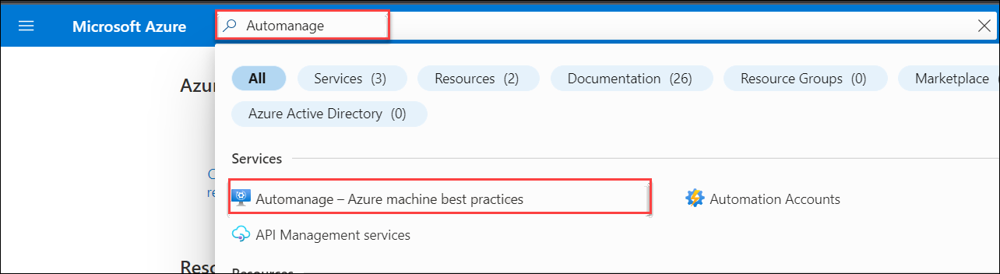
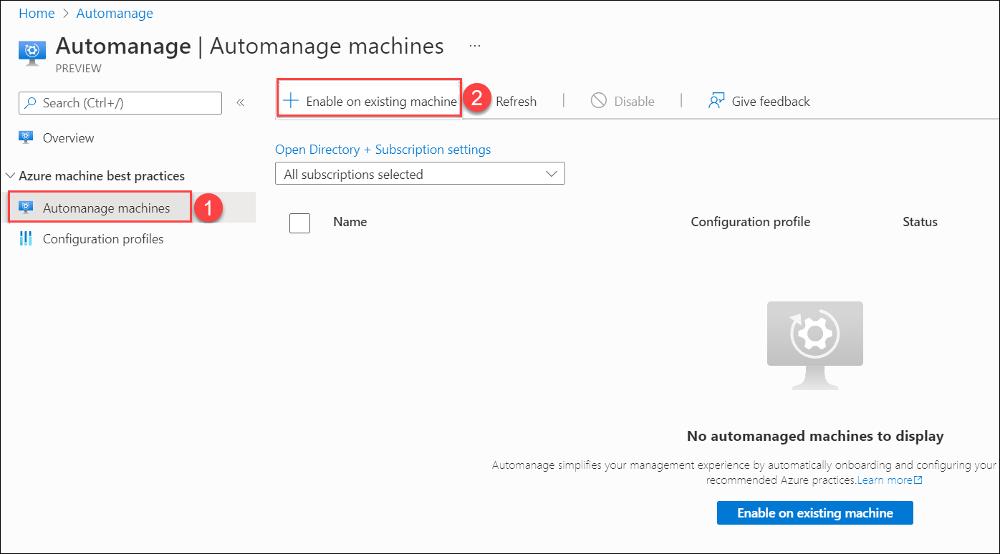
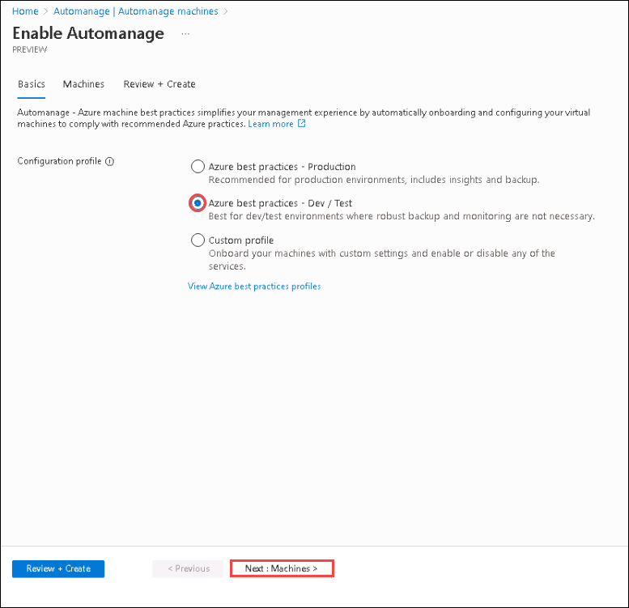

# Exercise 4: Enabling Azure Automanage for Server - Azure Arc
### Estimated Duration: 20 Minutes
## Overview: 

In this exercise you will focus on using Azure Automanage to automatically enroll, configure, and monitor a server connected to Azure Arc. Azure Automanage simplifies the lifecycle management of virtual machines (VMs) by applying best practices for security, updates, and monitoring. It leverages services like Azure Security Center, Update Management, and Log Analytics for comprehensive VM management.

## Objectives

In this exercise, you will be performing the following task:

- Task 01: Configuring Azure Automanage

## Task 1: Configuring Azure Automanage

1. Navigate to the home page of the [Azure Portal](https://portal.azure.com/#home), then search for **Automanage** in the search box and select **Automanage - Azure machine best practices**.

   
   
2. From the Automanage pane, select **Automanage machines (1)** under Azure machine best practices and click on **+ Enable on existing machine (2)**.

   

3. On Enable Automanage - Azure machine best practices page, select **Azure best practices - Dev / Test** and click on **Next: Machines**.

   

4. In Select machines pane, select the **ubuntu-k8s** Server - Azure Arc and click on **Review + Create**.

   

5. Click on **Create**.

   

6. Once the Configuration profile assignment is completed successfully it will take around 20-30 minutes to get the Status as Conformant.

   

7. You can proceed with the next task and review the status later.

## Summary

In this task, you used Azure Automanage to enroll and configure a VM, applying the "Azure best practices - Dev/Test" profile. This setup automates lifecycle management, including security, updates, change tracking, and monitoring through tools like Azure Security Centre and Log Analytics.

### You have successfully completed the Exercise
