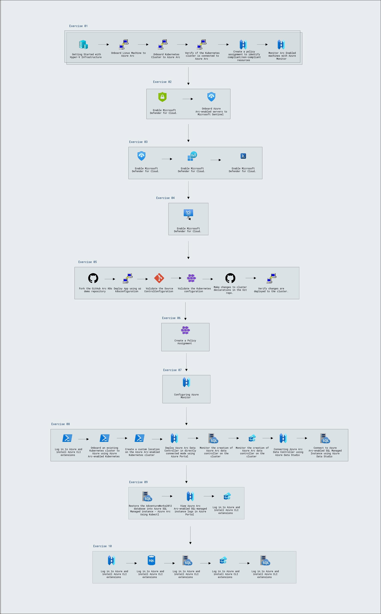

# **Getting Started with Your  Hybrid Cloud Solution Hands On Lab**
 
Welcome to your Hybrid Cloud Solution(Azure Arc) Hands On Lab! We've prepared a seamless environment for you to explore and learn about Azure services. Let's begin by making the most of this experience:

## Overall Estimated Duration: 8 Hours

## Overview

Azure Arc is a solution that extends Azure's capabilities to manage and run applications and services across diverse environments such as datacenters, edge locations, and multicloud platforms. It provides a unified approach for developing, operating, and securing both new and existing applications using the same tools, security measures, and governance mechanisms available within the Azure ecosystem. Azure Arc enables you to utilize Azure services—such as application management, data, and AI—on existing hardware, virtualization platforms, Kubernetes clusters, IoT devices, and integrated systems.

## Objectives

- **Getting Started with Azure Arc**: Azure Arc is a service that extends Azure management to on-premises, other cloud providers, and edge environments. You'll learn how to use Azure Arc to manage resources consistently across your hybrid and multi-cloud deployments.
- **Onboard Azure Arc-enabled servers to Microsoft Sentinel and Microsoft Defender for Cloud**: Enhance the security of your Azure Arc-enabled servers by enabling Microsoft Defender for Cloud and onboarding these servers to Microsoft Sentinel.
- **Onboard SQL Server to Arc**: Connect your Azure Arc-enabled SQL Server to Azure Arc for centralized management, monitoring, and governance. Run an on-demand assessment to get insights into the server's health, performance, and security. This information helps you identify issues, optimize resources, and ensure compliance.
- **Enabling Azure Automanage for Server - Azure Arc**: Azure Automanage enrols, configures, and monitors the entire lifecycle of dev/test and production VMs for products, services and features such as Azure Security Centre, update management, change tracking, VM inventory, desired state configuration, guest configuration, automation accounts and log analytics.
- **Enable GitOps Configuration on connected K8s Cluster**: Use GitOps to deploy and manage containerized applications on Azure Arc-enabled Kubernetes clusters. You'll configure a Git repository to store the desired state of your Kubernetes applications, and then use an operator to automatically deploy and update these configurations across multiple clusters. This approach centralizes management and empowers developers to contribute directly to the Git repository.
- **Enforce GitOps using Azure Policy for Azure Arc-enabled Kubernetes**: Use Azure Policy to enforce that each Azure Arc-enabled Kubernetes cluster has specific GitOps configurations applied to it.
- **Onboard Azure Monitor for containers with Azure Arc-enabled Kubernetes cluster**: Configure Azure Monitor for containers and view insights for Kubernetes - Azure Arc resource.
- **Deploying Azure Arc Data Controller with direct connectivity mode and Azure Arc-enabled SQL Managed Instance Business Critical**: Connect an existing Kubernetes cluster to Azure using Azure Arc-enabled Kubernetes. You will be deploying an Azure data controller in direct connectivity mode to a custom location using Azure portal and Azure CLI, and later you will be creating the Azure Arc-enabled SQL Managed Instance Business Critical on top of the Azure Arc Data Controller. In the short term, you will be preparing an infrastructure for the next exercise to restore the Databases into the Azure SQL Managed Instance.
- **Restoring an AdventureWorks database backup taken from SQL Server 2012 instance**: Restore the AdventureWorks2012 database into an Azure Arc-enabled SQL managed instance using kubectl, then view the instance logs in the Azure portal, and finally monitor the instance using Azure Data Studio.
- **Connecting to Azure Arc Data Controller and deploying Azure Arc-enabled SQL Managed Instance Business Critical in Indirect connectivity mode**: Connect to the pre-deployed Azure Arc Data Controller with indirect connectivity mode using Azure Data Studio. we will also create an Azure Arc-enabled SQL Managed Instance Business Critical on top of an Azure Arc Data Controller with indirect connectivity mode.

## Prerequisites

Participants should have: Basic knowledge and understanding of the following

- Basic understanding of Azure Kubernetes Service and managing workloads within them.
- Experience with Azure cloud services, including how to navigate the Azure portal.
- Basic knowledge Azure Arc.
- Knowledge of Microsoft Sentinel for threat detection and security monitoring.
- Basic knowledge of GitOps .
  
## Architecture Diagram

In the Azure Arc architecture, **Azure Arc** enables unified management for Contoso's on-premises **Windows** and **Linux VMs** and **Kubernetes clusters**. **Azure Policy** ensures governance and compliance, while **Microsoft Defender for Cloud** provides comprehensive security. **Azure Monitor** tracks performance and metrics, with **Azure Monitor for Containers** offering observability for Kubernetes clusters. **Azure Arc-enabled SQL Managed Instance** and **Azure Arc-enabled PostgreSQL Hyperscale** deliver scalable, cloud-native data management. **GitOps** manages Kubernetes configurations, and **Azure Data Controller** facilitates the deployment and management of data services. This setup simplifies operations and extends Azure’s capabilities across Contoso's diverse IT environments.

## Explanation of Components

- **Azure Kubernetes Service (AKS):** A managed Kubernetes service for running and managing containerized applications in the cloud.
- **Azure Arc:** Extends Azure management and governance to on-premises, multi-cloud, and edge environments.
- **Azure Monitor:** A unified monitoring service to track application and infrastructure performance.
- **Microsoft Defender for Cloud:** A cloud security solution that provides advanced threat protection for Azure and hybrid environments.
- **Microsoft Sentinel:** A scalable cloud-native security information and event management (SIEM) tool for threat detection and response.
- **GitOps for Kubernetes:** An operational model that uses Git repositories as the source of truth for automated Kubernetes deployments.
- **Azure Data Services:** Cloud-native, managed services for SQL and PostgreSQL, available across hybrid environments with Azure Arc.

## Accessing Your Lab Environment
 
1. You can see a virtual machine desktop 💻 (LabVM/ARCHOST) is loaded on the left side of your browser. Use this virtual machine throughout the workshop to perform the lab.

    

### Virtual Machine & Lab Guide
 
Your virtual machine is your workhorse throughout the workshop. The lab guide is your roadmap to success.
 
## Exploring Your Lab Resources
 
To get a better understanding of your lab resources and credentials, navigate to the **Environment Details** tab.

   
 
## Utilizing the Split Window Feature
 
For convenience, you can open the lab guide in a separate window by selecting the **Split Window** button from the Top right corner.
 
   
 
## Managing Your Virtual Machine
 
Feel free to start, stop, or restart your virtual machine as needed from the **Resources** tab. Your experience is in your hands!
 
  .png)

## Let's Get Started with Azure Portal
 
1. In the **LabVM/ARCHost VM**, double-click on the Azure portal shortcut of the Microsoft Edge browser provided on the desktop.
 
    
 
2. You'll see the **Sign into Microsoft Azure** tab. Here, enter your credentials:
 
   - **Email/Username:** <inject key="AzureAdUserEmail"></inject>
 
      
 
3. Next, provide your password:
 
   - **Password:** <inject key="AzureAdUserPassword"></inject>
 
      
     
1. If you see the pop-up **Action Required**, keep default and then click on **Ask later**. If you see the pop-up Help us protect your account, click on **Skip for now**(14 days until this is required), and then click on **Next**.

   
 
4. If you see the pop-up **Stay Signed in?**, click **No**.

   

5. If you see the pop-up **You have free Azure Advisor recommendations!**, close the window to continue the lab.

6. If a **Welcome to Microsoft Azure** popup window appears, click **Maybe Later** to skip the tour.

## Support Contact
The CloudLabs support team is available 24/7, 365 days a year, via email and live chat to ensure seamless assistance at any time. We offer dedicated support channels tailored specifically for both learners and instructors, ensuring that all your needs are promptly and efficiently addressed.

Learner Support Contacts:

   - Email Support: labs-support@spektrasystems.com.
   - Live Chat Support: https://cloudlabs.ai/labs-support
   
Now you're all set to explore the powerful world of technology. Feel free to reach out if you have any questions along the way. Enjoy your workshop! 
