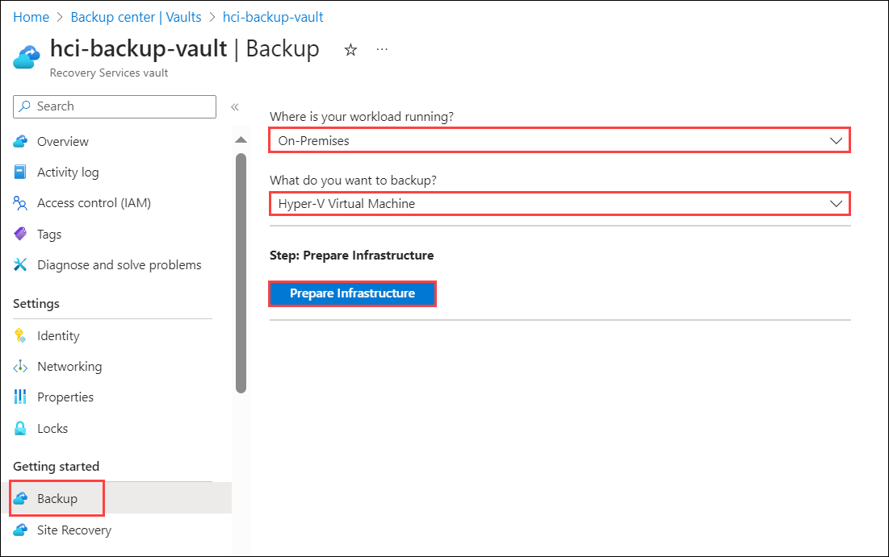
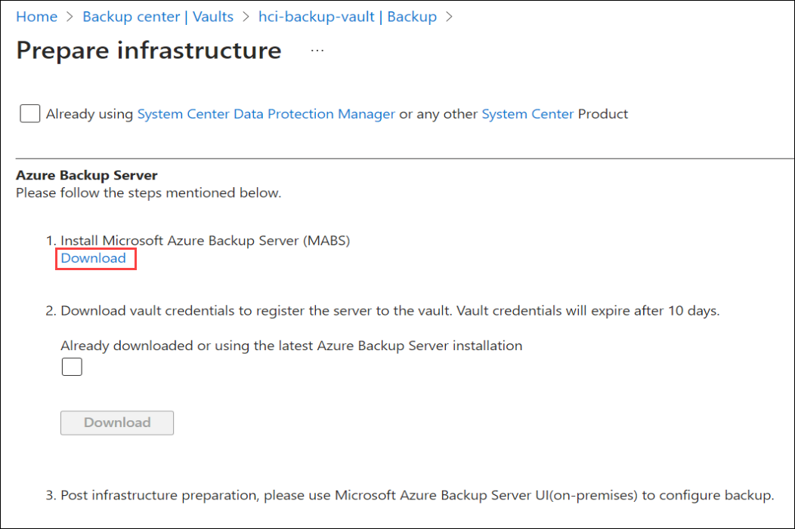
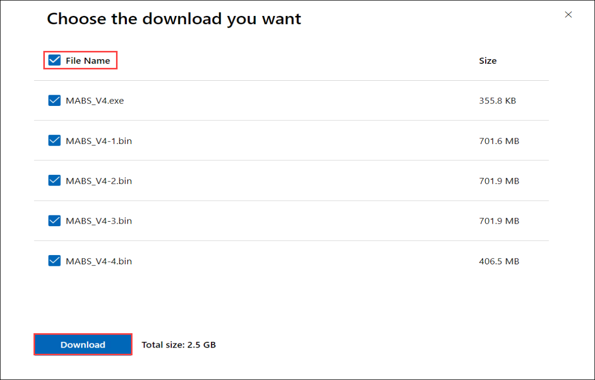

# Not Required Steps

## HOL 2: Exercise: 1
### Task 1: Install Windows Admin Center on each Node

1. On the **HCIBox-Client** virtual machine, click on search button search for **Hyper-V** and select **Hyper-V Manager**.

   

2. On the **Hyper-V Manager**, select **HCIBOX-CLIENT** from the left menu under the Hyper-V Manager list, and  double-click on **AzHost1** node.

   

3. Connect to **AzHost1** box, and then click on the Connect button.

   

4. On the **login** window, enter the Username as **arcdemo** hit **tab** button, enter password as **ArcPassword123!!** and hit **Enter** to login. 

   

5. On the **Welcome to Azure Stack HCI** window, in **Enter number to select an option** enter **15** and hit **Enter** button. 

   

6. Run the following command to install **Windows Admin Center**.

   ```
   msiexec /i WindowsAdminCenter.msi /qn /L*v log.txt SME_PORT=6516 SSL_CERTIFICATE_OPTION=generate
   ```

7. Install **Windows Admin Center** for **AzHost2** node, by repeating the **step 4 to step 6** .

# HOL 2: Exercise 2

1. From the Backup center, select Vaults under Manage and select your **hci-backup-vault** vault to open its dashboard.

    

2. In the vault's Getting Started menu, select **Backup** to open the Getting Started wizard. In the backup menu, from the **Where is your workload running** menu, select **On-premises**. From the **What do you want to backup?** drop-down menu, select **Hyper-V Virtual Machines** and then select **Prepare Infrastructure**.

    
  
3. In the **Prepare infrastructure** menu, select **Download** to open a web page to download Azure Backup Server installation files.

    

   The Microsoft web page that hosts the downloadable files for Azure Backup Server, opens.

4. In the Microsoft Azure Backup Server download page, choose a language, and select **Download**.

   

5. The Azure Backup Server installer is composed of eight files - an installer and four .bin files. Check **File Name** to select all required files and select **Download** to Download all files to the same folder. You may see a pop-up to allow multiple files download, click **Allow**.

    
