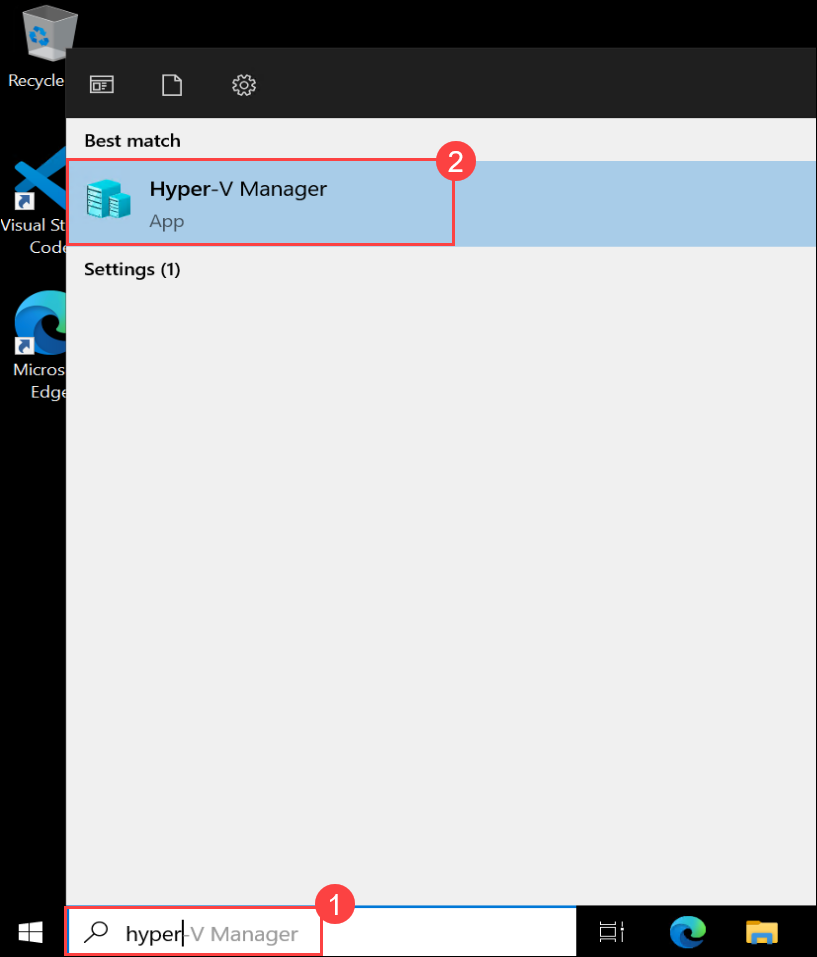
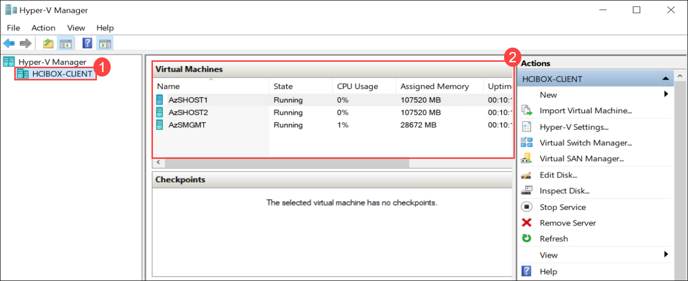
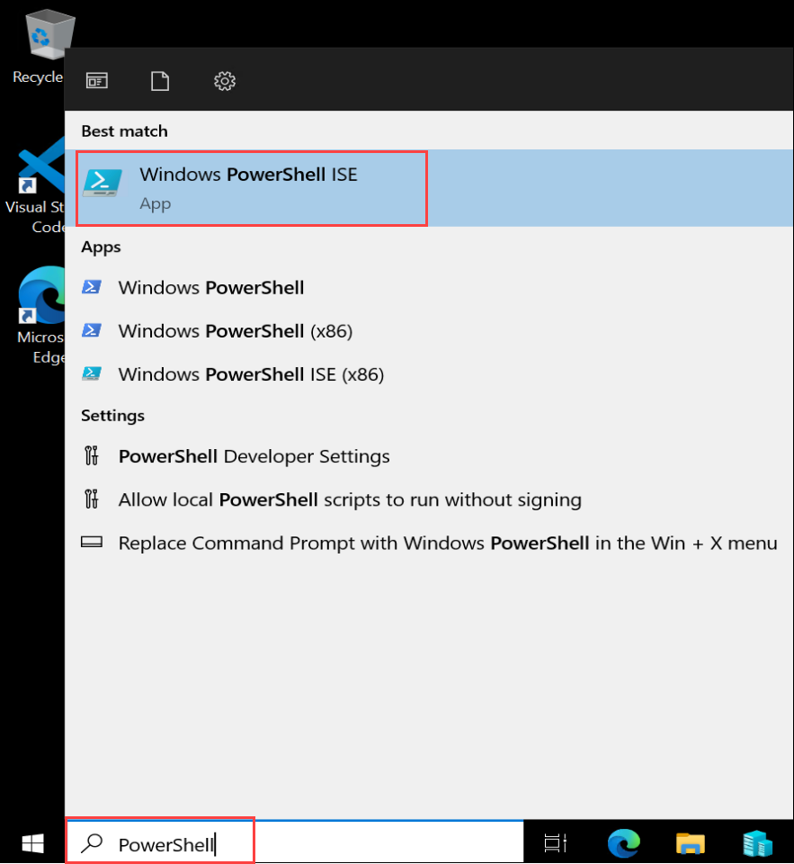

# Azure HCI Eternal Training Hands-on Lab: 1

## Exercise 1: Preparing env with the prerequisites to Deploy Azure Stack HCI 

In this exercise, you'll be preparing the environment for deploying Azure Stack HCI involves installing and configuring the necessary operating system (e.g., Windows Server), along with any required drivers and software. Additionally, configuring networking components such as switches and routers to meet Azure Stack HCI's networking requirements is essential for successful deployment.

### Task 1: Review the configured virtualized Azure Stack VMs 

1. In the LabVM, serch for Hyper-V Manger in search box. Select **Hyper-V Manager**.

   
    
   
2. From Hyper-V Manager, click on **HCIBOX-CLIENT** and review the **AzSHOST1**, **AzSHOST2** and **AzSMGMT** virtual machine are up and running as shown in the below screenshot.

   

### Task 2: Onboard Azure Arc Machine to Azure 

1. Open **Windows PowerShell ISE** from LabVM by searching **Powershell**.

   

2. Run the below commands to onboard Azure Arc Machines to Azure:

```
   function Set-HCIDeployPrereqs {
    param (
        $HCIBoxConfig,
        [PSCredential]$localCred,
        [PSCredential]$domainCred
    )
    Invoke-Command -VMName $HCIBoxConfig.MgmtHostConfig.Hostname -Credential $localCred -ScriptBlock {
        $HCIBoxConfig = $using:HCIBoxConfig
        $localCred = $using:localcred
        $domainCred = $using:domainCred
        Invoke-Command -VMName $HCIBoxConfig.DCName -Credential $domainCred -ArgumentList $HCIBoxConfig -ScriptBlock {
            $HCIBoxConfig = $args[0]
            $domainCredNoDomain = new-object -typename System.Management.Automation.PSCredential `
                -argumentlist ($HCIBoxConfig.LCMDeployUsername), (ConvertTo-SecureString $HCIBoxConfig.SDNAdminPassword -AsPlainText -Force)

            Install-PackageProvider -Name NuGet -MinimumVersion 2.8.5.201 -Force -Scope CurrentUser
            Install-Module AsHciADArtifactsPreCreationTool -Repository PSGallery -Force -Confirm:$false
            $domainName = $HCIBoxConfig.SDNDomainFQDN.Split('.')
            $ouName = "OU=$($HCIBoxConfig.LCMADOUName)"
            foreach ($name in $domainName) {
                $ouName += ",DC=$name"
            }
            $nodes = @()
            foreach ($node in $HCIBoxConfig.NodeHostConfig) {
                $nodes += $node.Hostname.ToString()
            }
            Add-KdsRootKey -EffectiveTime ((Get-Date).AddHours(-10))
            New-HciAdObjectsPreCreation -AzureStackLCMUserCredential $domainCredNoDomain -AsHciOUName $ouName
        }
    }

    foreach ($node in $HCIBoxConfig.NodeHostConfig) {
        Invoke-Command -VMName $node.Hostname -Credential $localCred -ArgumentList $env:subscriptionId, $env:spnTenantId, $env:spnClientID, $env:spnClientSecret, $env:resourceGroup, $env:azureLocation -ScriptBlock {
            $subId = $args[0]
            $tenantId = $args[1]
            $clientId = $args[2]
            $clientSecret = $args[3]
            $resourceGroup = $args[4]
            $location = $args[5]

            # Prep nodes for Azure Arc onboarding
            winrm quickconfig -quiet
            netsh advfirewall firewall add rule name="ICMP Allow incoming V4 echo request" protocol=icmpv4:8,any dir=in action=allow

            # Register PSGallery as a trusted repo
            Install-PackageProvider -Name NuGet -MinimumVersion 2.8.5.201 -Force
            Register-PSRepository -Default -InstallationPolicy Trusted -ErrorAction SilentlyContinue
            Set-PSRepository -Name PSGallery -InstallationPolicy Trusted

            #Install Arc registration script from PSGallery
            Install-Module AzsHCI.ARCinstaller -Force

            #Install required PowerShell modules in your node for registration
            Install-Module Az.Accounts -Force
            Install-Module Az.ConnectedMachine -Force
            Install-Module Az.Resources -Force
            $azureAppCred = (New-Object System.Management.Automation.PSCredential $clientId, (ConvertTo-SecureString -String $clientSecret -AsPlainText -Force))
            Connect-AzAccount -ServicePrincipal -SubscriptionId $subId -TenantId $tenantId -Credential $azureAppCred
            $armtoken = Get-AzAccessToken

            # Workaround for BITS transfer issue
            Get-NetAdapter StorageA | Disable-NetAdapter -Confirm:$false | Out-Null
            Get-NetAdapter StorageB | Disable-NetAdapter -Confirm:$false | Out-Null

            #Invoke the registration script.
            Invoke-AzStackHciArcInitialization -SubscriptionID $subId -ResourceGroup $resourceGroup -TenantID $tenantId -Region $location -Cloud "AzureCloud" -ArmAccessToken $armtoken.Token -AccountID $clientId

            Get-NetAdapter StorageA | Enable-NetAdapter -Confirm:$false | Out-Null
            Get-NetAdapter StorageB | Enable-NetAdapter -Confirm:$false | Out-Null
        }
    }

    Get-AzConnectedMachine -ResourceGroupName $env:resourceGroup | foreach-object {

        Write-Host "Checking extension status for $($PSItem.Name)"

        $requiredExtensions = @('AzureEdgeTelemetryAndDiagnostics', 'AzureEdgeLifecycleManager')
        $attempts = 0
        $maxAttempts = 90

        do {
            $attempts++
            $extension = Get-AzConnectedMachineExtension -MachineName $PSItem.Name -ResourceGroupName $env:resourceGroup

            foreach ($extensionName in $requiredExtensions) {
                $extensionTest = $extension | Where-Object { $_.Name -eq $extensionName }
                if (!$extensionTest) {
                    Write-Host "$($PSItem.Name) : Extension $extensionName is missing" -ForegroundColor Yellow
                    $Wait = $true
                } elseif ($extensionTest.ProvisioningState -ne "Succeeded") {
                    Write-Host "$($PSItem.Name) : Extension $extensionName is in place, but not yet provisioned. Current state: $($extensionTest.ProvisioningState)" -ForegroundColor Yellow
                    $Wait = $true
                } elseif ($extensionTest.ProvisioningState -eq "Succeeded") {
                    Write-Host "$($PSItem.Name) : Extension $extensionName is in place and provisioned. Current state: $($extensionTest.ProvisioningState)" -ForegroundColor Green
                    $Wait = $false
                }
            }

            if ($Wait){
            Write-Host "Waiting for extension installation to complete, sleeping for 2 minutes. Attempt $attempts of $maxAttempts"
            Start-Sleep -Seconds 120
            } else {
                break
            }

        } while ($attempts -lt $maxAttempts)
       }
}

$HCIBoxConfig = Import-PowerShellDataFile -Path $Env:HCIBoxConfigFile

# Set credentials
$localCred = new-object -typename System.Management.Automation.PSCredential `
   -argumentlist "Administrator", (ConvertTo-SecureString $HCIBoxConfig.SDNAdminPassword -AsPlainText -Force)

$domainCred = new-object -typename System.Management.Automation.PSCredential `
   -argumentlist (($HCIBoxConfig.SDNDomainFQDN.Split(".")[0]) +"\Administrator"), (ConvertTo-SecureString $HCIBoxConfig.SDNAdminPassword -AsPlainText -Force)

Write-Host "[Build cluster - Step 9/11] Preparing HCI cluster Azure deployment..." -ForegroundColor Green
Set-HCIDeployPrereqs -HCIBoxConfig $HCIBoxConfig -localCred $localCred -domainCred $domainCred

& "$Env:HCIBoxDir\Generate-ARM-Template.ps1"

```


Prepare to deploy Azure Stack HCI 
