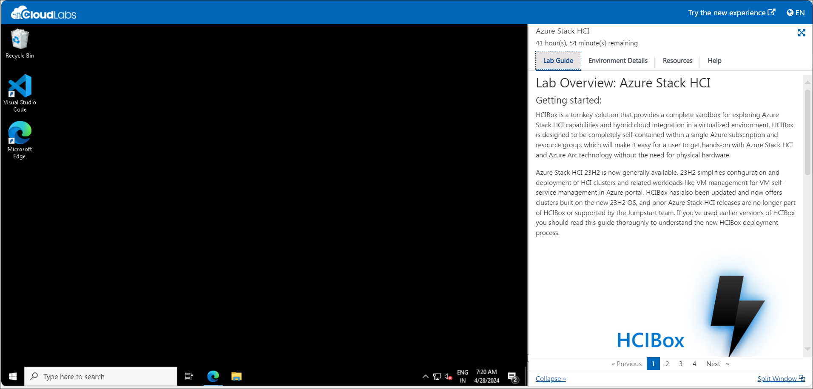
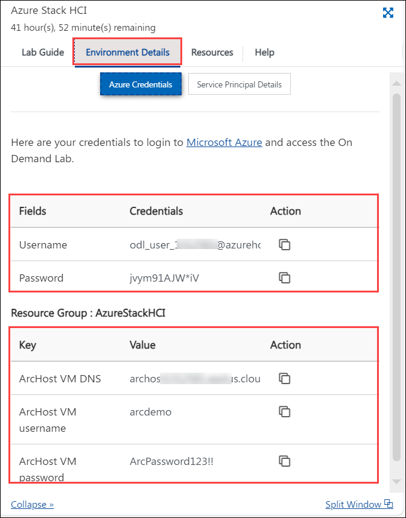
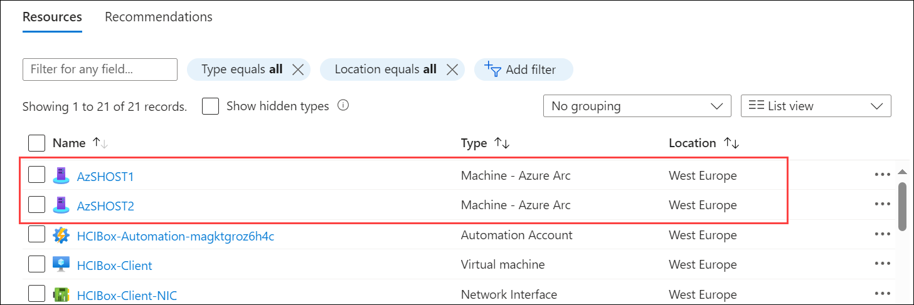

# Azure HCI Eternal Training Hands-on Lab: 1

Getting Started with Azure Stack HCI in Azure
-------------------------
       
# Getting Started with Lab

1. Once the environment is provisioned, a virtual machine i.e, **HCIBox-Client** and lab guide will get loaded in your browser. Use this virtual machine throughout the workshop to perform the lab.

   

1. To get the lab environment details, select the **Environment Details** tab. The credentials will also be emailed to your registered email address. You can open the Lab Guide on a separate and full window by selecting the **Split Window** from the lower right corner. Also, you can start, stop and restart virtual machines from the **Virtual Machines** tab.

   
 
## Login to Azure Portal

1. In the **HCIBox-Client** virtual machine, double click on the Microsoft Edge browser shortcut which is provided on the desktop.
  
    
    
1. Navigate to Azure Portal using the URL provided here: `https://portal.azure.com/`. On the **Sign into Microsoft Azure** tab, you will see the login prompt. Enter the following **Email/Username** and then click on **Next**. 
      
      * Email/Username: **<inject key="AzureAdUserEmail"></inject>**
   
1. Now, enter the **Password** which you have already received for the above account.
      
      * Password: **<inject key="AzureAdUserPassword"></inject>**
      
1. If you see the pop-up **Stay Signed in?**, click No

1. If you see the pop-up **You have free Azure Advisor recommendations!**, close the window to continue the lab.

1. If **Welcome to Microsoft Azure** popup window appears, click **Maybe Later** to skip the tour.

1. Navigate to the Resource Group in the Azure portal navigate section.

   

1. From the Resource groups pane, click on **AzureStakHCI** resource group and verify the resources present in it.

   

## Exercise 1: Preparing env with the prerequisites to Deploy Azure Stack HCI 

In this exercise, you'll be preparing the environment for deploying Azure Stack HCI involves installing and configuring the necessary operating system (e.g., Windows Server), along with any required drivers and software. Additionally, configuring networking components such as switches and routers to meet Azure Stack HCI's networking requirements is essential for successful deployment.

### Task 1: Review the configured virtualized Azure Stack VMs 

1. In the LabVM, serch for Hyper-V Manger in search box. Select **Hyper-V Manager**.

   
    
   
2. From Hyper-V Manager, click on **HCIBOX-CLIENT** and review the **AzSHOST1**, **AzSHOST2** and **AzSMGMT** virtual machine are up and running as shown in the below screenshot.

   

### Task 2: Onboard Azure Arc Machine to Azure and prepare to deploy Azure Stack HCI 

1. Open **Windows PowerShell ISE** from LabVM by searching **Powershell**.

   

2. Run the below commands to onboard Azure Arc Machines to Azure:

   >**Note**: Script execution will take upto 30 to 45 minutes to update the pre-requisites and to onboard Azure Arc Machine to Azure.

```
   function Set-HCIDeployPrereqs {
    param (
        $HCIBoxConfig,
        [PSCredential]$localCred,
        [PSCredential]$domainCred
    )
    Invoke-Command -VMName $HCIBoxConfig.MgmtHostConfig.Hostname -Credential $localCred -ScriptBlock {
        $HCIBoxConfig = $using:HCIBoxConfig
        $localCred = $using:localcred
        $domainCred = $using:domainCred
        Invoke-Command -VMName $HCIBoxConfig.DCName -Credential $domainCred -ArgumentList $HCIBoxConfig -ScriptBlock {
            $HCIBoxConfig = $args[0]
            $domainCredNoDomain = new-object -typename System.Management.Automation.PSCredential `
                -argumentlist ($HCIBoxConfig.LCMDeployUsername), (ConvertTo-SecureString $HCIBoxConfig.SDNAdminPassword -AsPlainText -Force)

            Install-PackageProvider -Name NuGet -MinimumVersion 2.8.5.201 -Force -Scope CurrentUser
            Install-Module AsHciADArtifactsPreCreationTool -Repository PSGallery -Force -Confirm:$false
            $domainName = $HCIBoxConfig.SDNDomainFQDN.Split('.')
            $ouName = "OU=$($HCIBoxConfig.LCMADOUName)"
            foreach ($name in $domainName) {
                $ouName += ",DC=$name"
            }
            $nodes = @()
            foreach ($node in $HCIBoxConfig.NodeHostConfig) {
                $nodes += $node.Hostname.ToString()
            }
            Add-KdsRootKey -EffectiveTime ((Get-Date).AddHours(-10))
            New-HciAdObjectsPreCreation -AzureStackLCMUserCredential $domainCredNoDomain -AsHciOUName $ouName
        }
    }

    foreach ($node in $HCIBoxConfig.NodeHostConfig) {
        Invoke-Command -VMName $node.Hostname -Credential $localCred -ArgumentList $env:subscriptionId, $env:spnTenantId, $env:spnClientID, $env:spnClientSecret, $env:resourceGroup, $env:azureLocation -ScriptBlock {
            $subId = $args[0]
            $tenantId = $args[1]
            $clientId = $args[2]
            $clientSecret = $args[3]
            $resourceGroup = $args[4]
            $location = $args[5]

            # Prep nodes for Azure Arc onboarding
            winrm quickconfig -quiet
            netsh advfirewall firewall add rule name="ICMP Allow incoming V4 echo request" protocol=icmpv4:8,any dir=in action=allow

            # Register PSGallery as a trusted repo
            Install-PackageProvider -Name NuGet -MinimumVersion 2.8.5.201 -Force
            Register-PSRepository -Default -InstallationPolicy Trusted -ErrorAction SilentlyContinue
            Set-PSRepository -Name PSGallery -InstallationPolicy Trusted
            #Enable WAC Installation
            Get-AsWdacPolicyMode 
            Enable-AsWdacPolicy -Mode Audit

            #Install Arc registration script from PSGallery
            Install-Module AzsHCI.ARCinstaller -Force

            #Install required PowerShell modules in your node for registration
            Install-Module Az.Accounts -Force
            Install-Module Az.ConnectedMachine -Force
            Install-Module Az.Resources -Force
            $azureAppCred = (New-Object System.Management.Automation.PSCredential $clientId, (ConvertTo-SecureString -String $clientSecret -AsPlainText -Force))
            Connect-AzAccount -ServicePrincipal -SubscriptionId $subId -TenantId $tenantId -Credential $azureAppCred
            $armtoken = Get-AzAccessToken

            # Workaround for BITS transfer issue
            Get-NetAdapter StorageA | Disable-NetAdapter -Confirm:$false | Out-Null
            Get-NetAdapter StorageB | Disable-NetAdapter -Confirm:$false | Out-Null

            #Invoke the registration script.
            Invoke-AzStackHciArcInitialization -SubscriptionID $subId -ResourceGroup $resourceGroup -TenantID $tenantId -Region $location -Cloud "AzureCloud" -ArmAccessToken $armtoken.Token -AccountID $clientId

            Get-NetAdapter StorageA | Enable-NetAdapter -Confirm:$false | Out-Null
            Get-NetAdapter StorageB | Enable-NetAdapter -Confirm:$false | Out-Null
        }
    }

    Get-AzConnectedMachine -ResourceGroupName $env:resourceGroup | foreach-object {

        Write-Host "Checking extension status for $($PSItem.Name)"

        $requiredExtensions = @('AzureEdgeTelemetryAndDiagnostics', 'AzureEdgeLifecycleManager')
        $attempts = 0
        $maxAttempts = 90

        do {
            $attempts++
            $extension = Get-AzConnectedMachineExtension -MachineName $PSItem.Name -ResourceGroupName $env:resourceGroup

            foreach ($extensionName in $requiredExtensions) {
                $extensionTest = $extension | Where-Object { $_.Name -eq $extensionName }
                if (!$extensionTest) {
                    Write-Host "$($PSItem.Name) : Extension $extensionName is missing" -ForegroundColor Yellow
                    $Wait = $true
                } elseif ($extensionTest.ProvisioningState -ne "Succeeded") {
                    Write-Host "$($PSItem.Name) : Extension $extensionName is in place, but not yet provisioned. Current state: $($extensionTest.ProvisioningState)" -ForegroundColor Yellow
                    $Wait = $true
                } elseif ($extensionTest.ProvisioningState -eq "Succeeded") {
                    Write-Host "$($PSItem.Name) : Extension $extensionName is in place and provisioned. Current state: $($extensionTest.ProvisioningState)" -ForegroundColor Green
                    $Wait = $false
                }
            }

            if ($Wait){
            Write-Host "Waiting for extension installation to complete, sleeping for 2 minutes. Attempt $attempts of $maxAttempts"
            Start-Sleep -Seconds 120
            } else {
                break
            }

        } while ($attempts -lt $maxAttempts)
       }
}

$HCIBoxConfig = Import-PowerShellDataFile -Path $Env:HCIBoxConfigFile

# Login to Azure to get access on the nodes
 $azureAppCred = (New-Object System.Management.Automation.PSCredential $env:spnClientID, (ConvertTo-SecureString -String $env:spnClientSecret -AsPlainText -Force))
Connect-AzAccount -ServicePrincipal -SubscriptionId $env:subscriptionId -TenantId $env:spnTenantId -Credential $azureAppCred

# Set credentials
$localCred = new-object -typename System.Management.Automation.PSCredential `
   -argumentlist "Administrator", (ConvertTo-SecureString $HCIBoxConfig.SDNAdminPassword -AsPlainText -Force)

$domainCred = new-object -typename System.Management.Automation.PSCredential `
   -argumentlist (($HCIBoxConfig.SDNDomainFQDN.Split(".")[0]) +"\Administrator"), (ConvertTo-SecureString $HCIBoxConfig.SDNAdminPassword -AsPlainText -Force)

Write-Host "[Build cluster - Step 9/11] Preparing HCI cluster Azure deployment..." -ForegroundColor Green
Set-HCIDeployPrereqs -HCIBoxConfig $HCIBoxConfig -localCred $localCred -domainCred $domainCred


```

3. Navigate to Azure portal and verify the Azure Arc Machines onboarded to Azure named **AzSHOST1** and **AzSHOST2**.

    >**Note**: If you see that only one Azure Arc machine got onboarded, please re-perform the previous step to complete the onboarding. 

   


