# Exercise 2: Deploying JumpStart-HCIBox in Azure Portal

In this exercise, you will be deploying an Azure Stack HCI solution using a pre-created ARM template from the previous exercise. You can deploy it either through the Azure portal by uploading the template and specifying deployment parameters, or using PowerShell for automated deployment, offering flexibility and control over the deployment process. Here, you will be deploying Azure Stack HCI using Deploy a custom template in Azure Portal.

### Task 1: Assign Azure Arc permission to Azure Stack HCI Resource Provider. 

1. Navigate to your Azure Stack HCI Resource Group and Click on **Access Control**.

    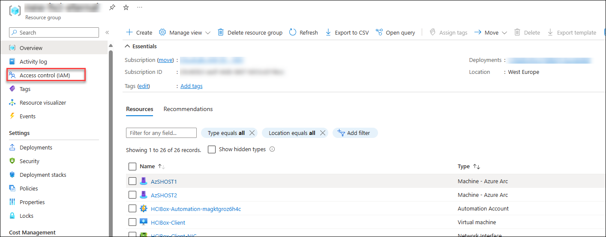

2. Click on **Add** -> **Add Role Assignment** and select **Azure Connected Machine Resource Manager** and click on Next button.

    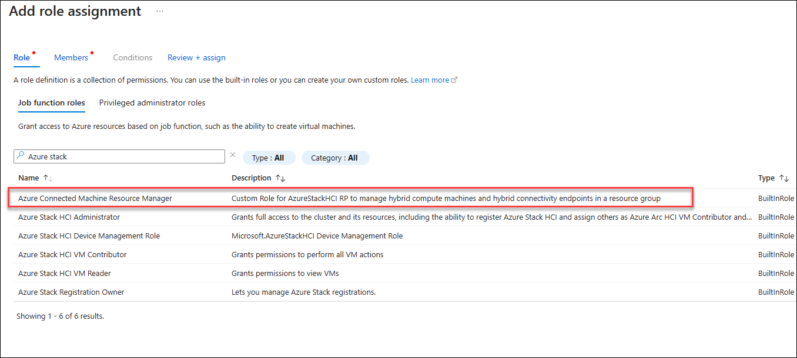

3. Now under Members page click on **select member** and select **Microsoft.AzureStackHCI Resource Provider** and click on Select, later click on **Review + Assign** to complete the asssignment.

    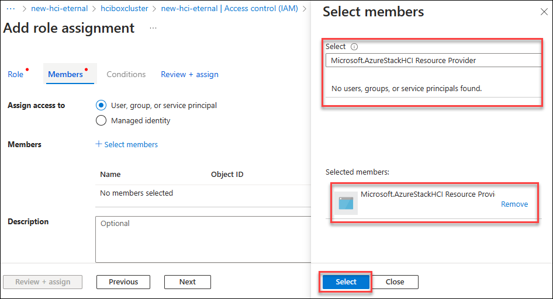

### Task 2: Create and Review the pre-created ARM template
   
1. Navigate to C:\HCIBox directory and right click on the file name **Generate-ARM-Template.ps1** and select run with Powershell. A powershell window  start and will close automatically after the execution and the creation of Azure Stack HCI ARM template completes. 

    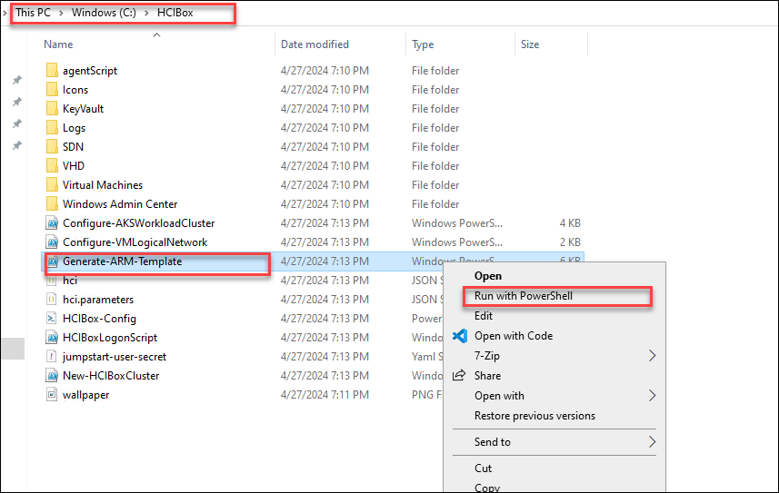
    
2. Now you will use the generated ARM template to validate the HCI cluster in Azure portal. Open File Explorer on HCIBox-Client and navigate to the C:\HCIBox folder. Right-click on the folder and open it in VSCode.

3. Open and review the hci.json and hci.parameters.json files in VSCode. Verify that the hci.parameters.json file looks correct without "-staging" placeholder parameter values.

    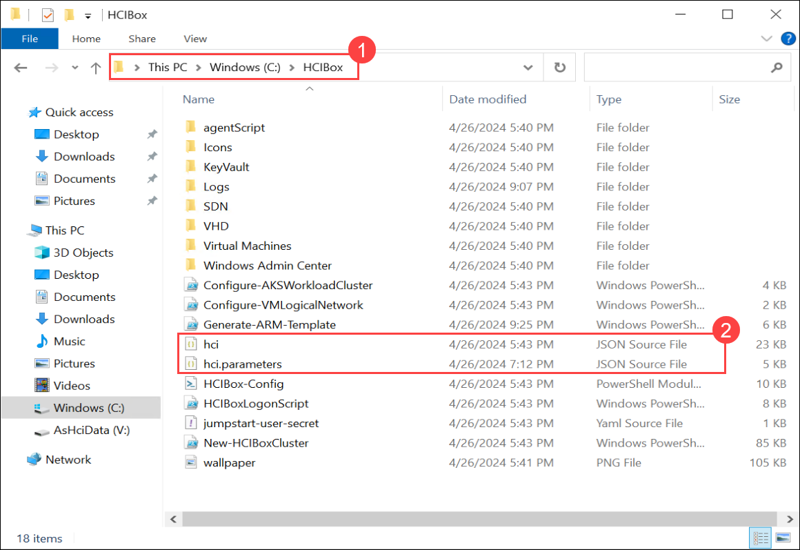

### Task 3: Vlidate and Deploy Azure Stack HCI cluster using Azure portal.

1. Navigate back to Azure Portal, search for **Deploy a custom template** in search box and select it.

    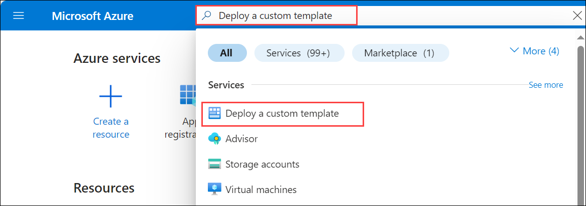

2. From Custom deployment page, click on **Build your own template in the editor**.

    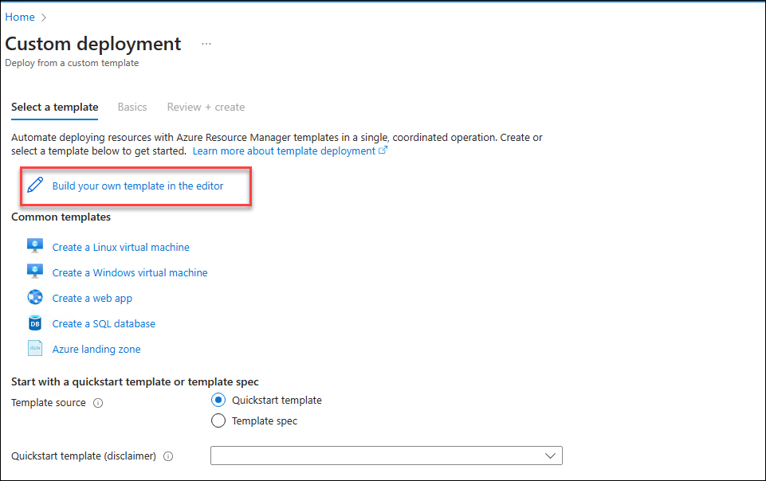

3. Copy the content of ARM file named **hci.json**, replace it in Edit template and click on **Save**.
      
    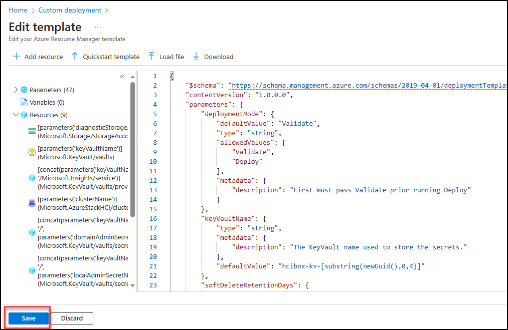

5. From Custom deployment page, click on Edit parameters. Replace the content with **hci.parameters.json** file and click on **Save**.

6. Select the available Subscription and **AzureStackHCI** Resource Group, review the values passed in Parameters and then click **Review + Create**.

   > Note: You dont need to make any changes in parameters section as these values are already update with the Powershell script executed in previous tasks.
   
    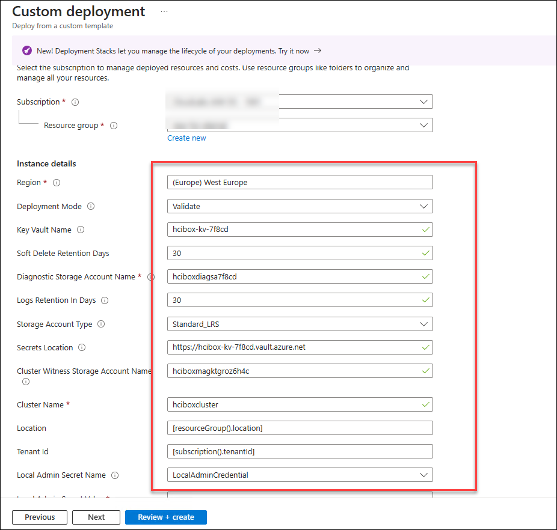

   > Note: If the Azure StackHCI Validation failed, On the deployment Page navigate back to Configuration section and update the local and domain Username password with the below values and retry the validation. It will take about 15 minutes to successfully validate the cluster deployment.
        * LCN User: HCIBoxDeployUser
        *LCN Password: ArcPassword123!!
        * Domain User: jumpstart
        * Domain Password: ArcPassword123!!

8. Once Custom deployment Validation is passed, click on **Create**. Wait for the deployment to get completed and navigate to Azure Stack HCI resource and you will see a warning on top of the resource, Click on the **Click Here** buttong to deploy your cluster.

    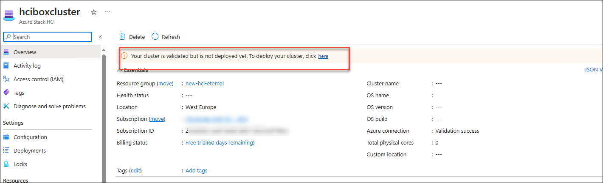

9. After clicking on the button, it will redirect you to **Deploy Azure Stack HCI** window and you should be able to see all the validation steps marked as **Succeeded** state, now click on **Next: Review + Create** button to deploy the Azure Stack HCI cluster.

    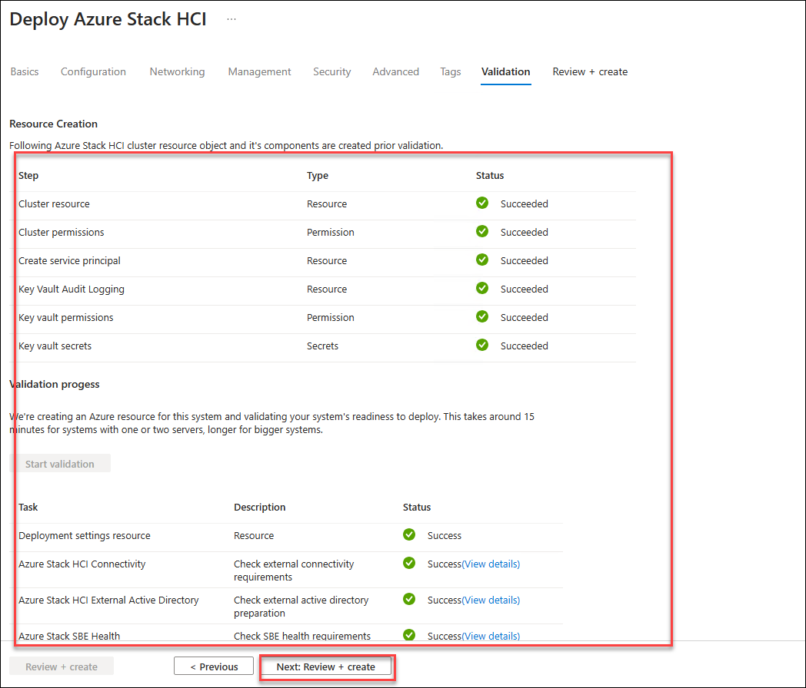
   
11. Once the deployment starts, you will be redirected to the **Deployment** tab on Azure Stack HCI resource.

     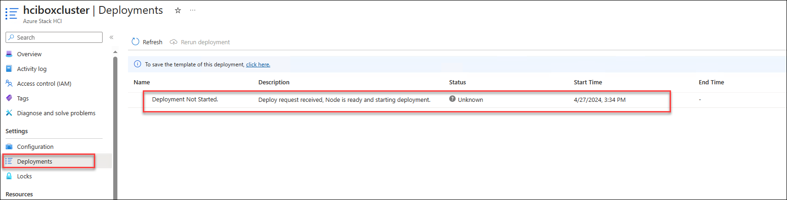
   
12. The cluster may take 3 to 5 hrs to get deployed. If you navigate elsewhere in the Azure Portal, you can return to monitor progress on the Deployments tab of the cluster resource. Click Refresh to get the latest status on deployment.

     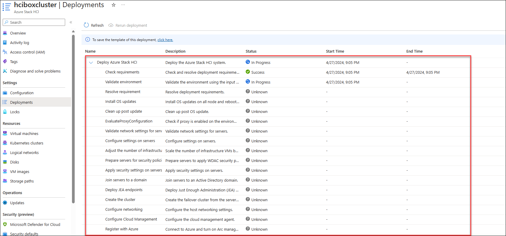
