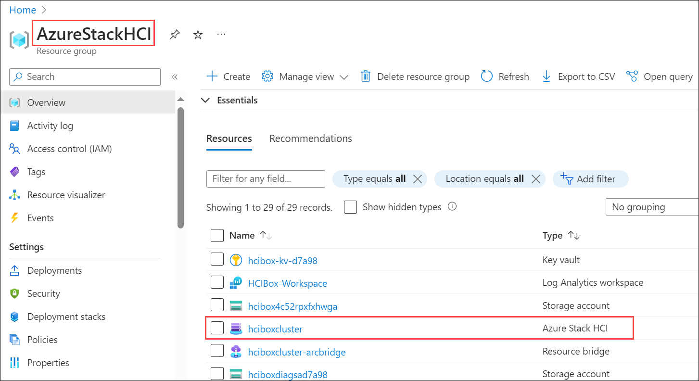
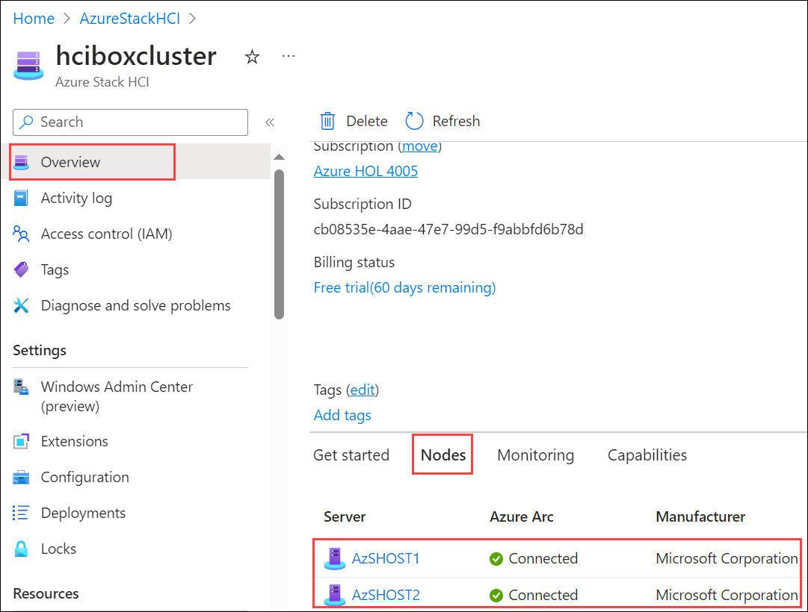
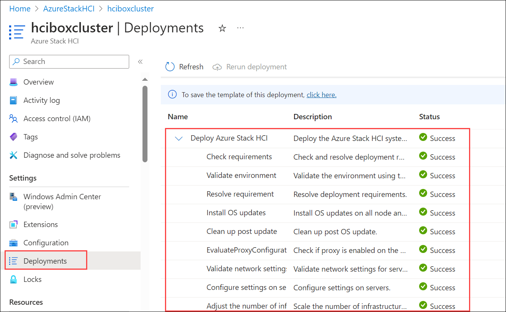

# Exercise 3: Verify the JumpStart HCIBox deployment

In this exercise, you'll be verifying and confirming the successful deployment and configuration of Azure Stack HCI in the Azure Portal.

### Task 1: Verify the Azure Stack HCI deployment in Azure and its configuration 

1. From Azure portal, open resource group named **AzureStackHCI**.

2. Select Azure Stack HCI resource named **hciboxcluster** from AzureStackHCI resource group.

   

3. In the Overview page of Azure Stack HCI resource, scroll-down and select **Nodes** to verify the Azure Arc Machines connected to **hciboxcluster**.

   

4. To verify the Azue Stack HCI cluster deployment, click on **Deployments** under Settings and verify that Deploy Azure Stack HCI is completed with status **Success**.

   

