# Azure HCI Eternal Training Hands-on Lab: 2

## Exercise 1: Configure and Monitor cluster performance from the Windows Admin Center dashboard

### Task 1: Install Windows Admin Center on each Node

1. On the **HCIBox-Client** virtual machine, click on search button search for **Hyper-V** and select **Hyper-V Manager**.

   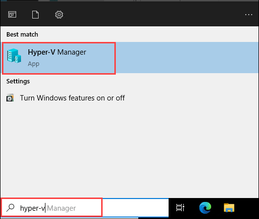

2. On the **Hyper-V Manager**, select **HCIBOX-CLIENT** from the left menu under the Hyper-V Manager list, and  double-click on **AzHost1** node.

   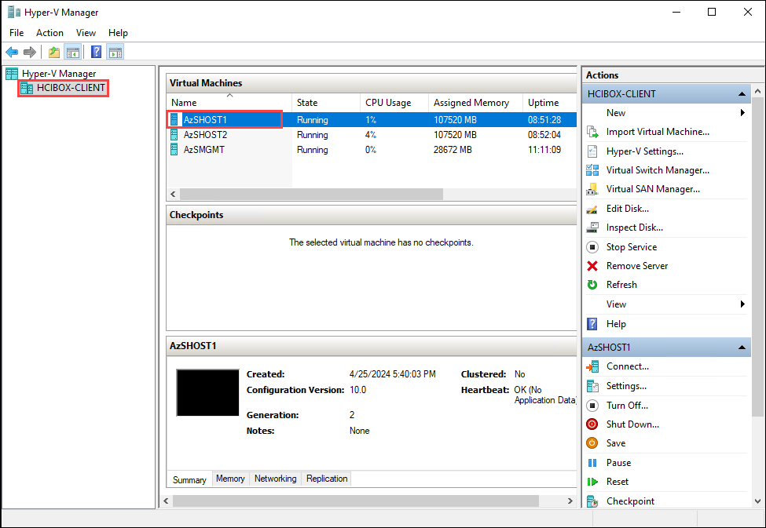

3. Connect to **AzHost1** box, and then click on the Connect button.

   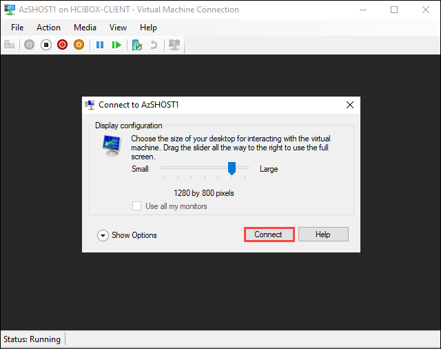

4. On the **login** window, enter the Username as **arcdemo** hit **tab** button, enter password as **ArcPassword123!!** and hit **Enter** to login. 

   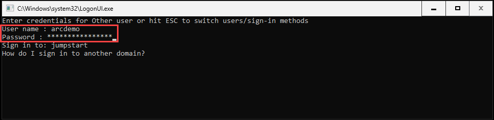

5. On the **Welcome to Azure Stack HCI** window, in **Enter number to select an option** enter **15** and hit **Enter** button. 

   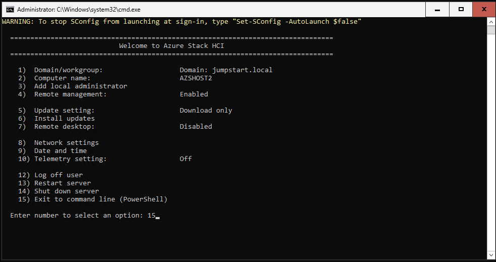

6. Run the following command to install **Windows Admin Center**.

   ```
   msiexec /i WindowsAdminCenter.msi /qn /L*v log.txt SME_PORT=6516 SSL_CERTIFICATE_OPTION=generate
   ```

7. Install **Windows Admin Center** for **AzHost2** node, by repeating the **step 4 to step 6** .

### Task 2: Assign Windows Admin Center Administrator Login role to User 

1. Navigate to your Azure Stack HCI Resource Group and Click on **Access Control**.

    

2. Click on **Add** -> **Add Role Assignment** and select **Windows Admin Center Administrator Login** and click on Next button.

    

3. Now under Members page click on **User, group, or service principle** and select **<inject key="AzureAdUserEmail"></inject>** and click on Select, later click on **Review + Assign** to complete the asssignment.

   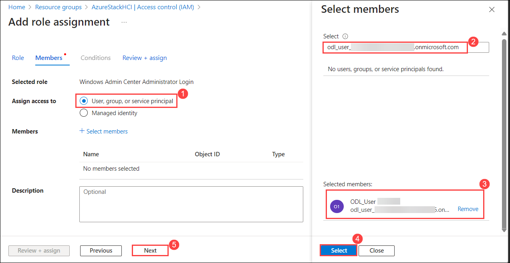

4. In the **Review + assign** tab, click on **Review + assign** button.

   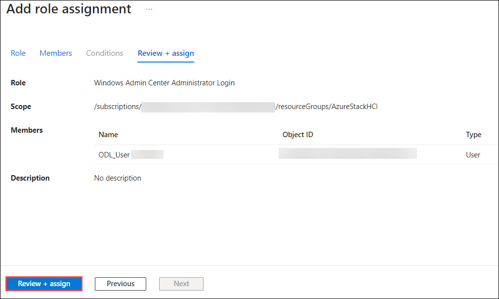

### Task 3: Create a Logical Network for Azure Stack HCI Virtual machines

1. Navigate to the Resource Group in the Azure portal navigation section.

   

2. From the Resource groups pane, click on **AzureStakHCI** resource group and verify the resources present in it.

   

3. In the  **AzureStakHCI** resource group in the search bar search for **hciboxcluster** **(1)** and select **hciboxcluster** **(2)** Azure Stack HCI.

   

4. In the **hciboxcluster** Azure Stack HCI, from the left menu select **Logical networks** **(1)** under Resources, and click on **+ Create logical network** **(2)**.

   

5. In the **Create logical network** tab, under Basic fill the fallowing details and click on **Next: Network Configuartion** **(5)**.

    - Subscription : Default subscription **(1)**
    - Resource group : **AzureStackHCI** **(2)**
    - Logical network name: **hcibox-aks-lnet-vlan110** **(3)**
    - Virtual switch name: **ConvergedSwitch(hci)** **(4)**

   

6. In the **Network Configuation** tab, under the fallowing deatils and click on **Next: Tags** **(9)**.

    | **Variables**                | **Values**                                                    |
    | ---------------------------- |---------------------------------------------------------------|
    | IP address assignment | **Static** **(1)** |
    | IPv4 address space    | **10.10.0.0** **(2)** from the drop down  address prefix select **\24** **(3)** |
    | IP pools              | Enter Start IP **10.10.0.101** **(4)** and End IP **10.10.0.199** **(5)** |
    | Default Gateway       | Enter Default Gateway address as **10.10.0.1** **(6)** |
    | DNS Servers           | Enter DNS Servers **192.168.1.254** **(7)** |
    | VLAN ID               | Enter **110** **(8)** | 

   

7. In the **Tag** tab, leave it as default and click **Next: Review + Create**.

8. In the **Review + Create** tab, click on on **Create** button.

   

9. In the Azure portal, click on the search blade at the top and search for **Microsoft Entra id** and select **Microsoft Entra id**.

   

10. In the **Microsoft Entra id** tab, from the left menu select **Groups** under Manage. 

    

11. In the **Groups | All groups** tab, select **All groups** **(1)**,  and click on **New Group** **(2)**.

    

12. In the **New Group** tab, enter the **Group name** as **aks-auth** **(1)**, click on the **No Owner Selected** **(2)** under **Owners**, from the search **(3)** and select **(4)** for user **ODL_User <inject key="DeploymentID"></inject>**, and click on **Select** **(5)**.

    

13. In the **New Group** tab, click on **Create** button.

    

14. In the Azure portal, click on the search blade at the top and search for **Kubernetes services** and select **Kubernetes services**.

    

15. In the **Kubernetes services** tab, click on **+ Create** **(1)** and from the drop-down select **Create a Kubernetes cluster with Azure Arc** **(2)**.

    

16. In the **Create a Kubernetes cluster with Azure Arc​** tab, fill the fallowing deatils in the Basic and click on **Next: Node Pool** **(7)**.

     | **Variables**                | **Values**                                                    |
     | ---------------------------- |---------------------------------------------------------------|
     | Subscription | Default subscription **(1)** |
     | Resource group | From the drop-down Select **AzureStackHCI** **(2)**  |
     | Kubernetes cluster name | Enter the cluster name as **hciaks** **(3)** |
     | Custom location | From the drop-down Select **jumpstart(EastUS)** **(4)** |
     | Node size | From the drop down select **Standard_A2_v2** **(5)** |
     | Key pair name | Enter the Key pair name as **hciaks** **(6)** |

    

17. In the **Node Pool** tab, leave it default and click in **Next: Access**.

18. In the **Access** tab, select **Authentication and Authorization** method as **Microsoft Entra authentication with Kubernetes RBAC** **(1)**, and Click on **Choose Microsoft Entra group** **(2)**. 

    

19. In the **Choose Microsoft Entra group for cluster-admin ClusterRoleBinding** pop-up select **aks-auth** group and click on **Select**.

    

20. In the **Access** tab, click on **Next: Networking**.

21. In the **Networking** tab, select **Local network** as **hcibox-aks-lnet-vlan110** **(1)**, enter **Control plane IP** as **10.10.0.5** **(2)**, and click on **Review + Create** **(3)** .

    

22. In the **Review + Create** tab, click on **Review**.

    

### Task 5: 

1. Navigate to the Resource Group in the Azure portal navigation section.

   

2. From the Resource groups pane, click on **AzureStakHCI** resource group and verify the resources present in it.

   

3. In the  **AzureStakHCI** resource group in the search bar search for **hciboxcluster** **(1)** and select **hciboxcluster** **(2)** Azure Stack HCI.

   

4. In the **hciboxcluster** Azure Stack HCI, from the left menu select **Logical networks** **(1)** under Resources, and click on **+ Create logical network** **(2)**.

   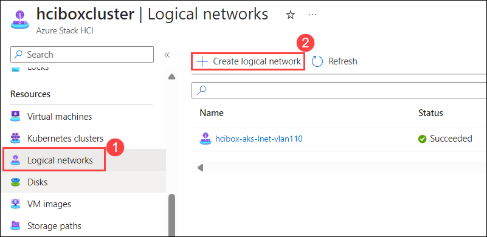

5. In the **Create logical network** tab, under Basic fill the fallowing details and click on **Next: Network Configuartion** **(5)**.

    - Subscription : Default subscription **(1)**
    - Resource group : **AzureStackHCI** **(2)**
    - Logical network name: **hcibox-vm-lnet-vlan200** **(3)**
    - Virtual switch name: **ConvergedSwitch(hci)** **(4)**

      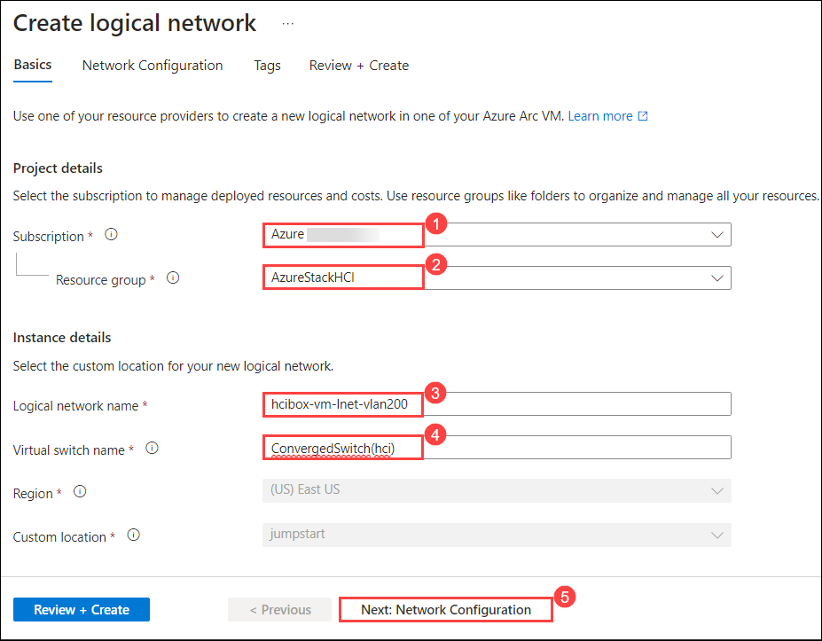

6. In the **Network Configuation** tab, under the fallowing deatils and click on **Next: Tags** **(7)**.

    | **Variables**                | **Values**                                                    |
    | ---------------------------- |---------------------------------------------------------------|
    | IP address assignment | **Static** **(1)** |
    | IPv4 address space    | **192.168.200.0** **(2)** from the drop down  address prefix select **\24** **(3)** |
    | Default Gateway       | Enter Default Gateway address as **192.168.200.1** **(4)** |
    | DNS Servers           | Enter DNS Servers **192.168.1.254** **(5)** |
    | VLAN ID               | Enter **200** **(6)** | 

      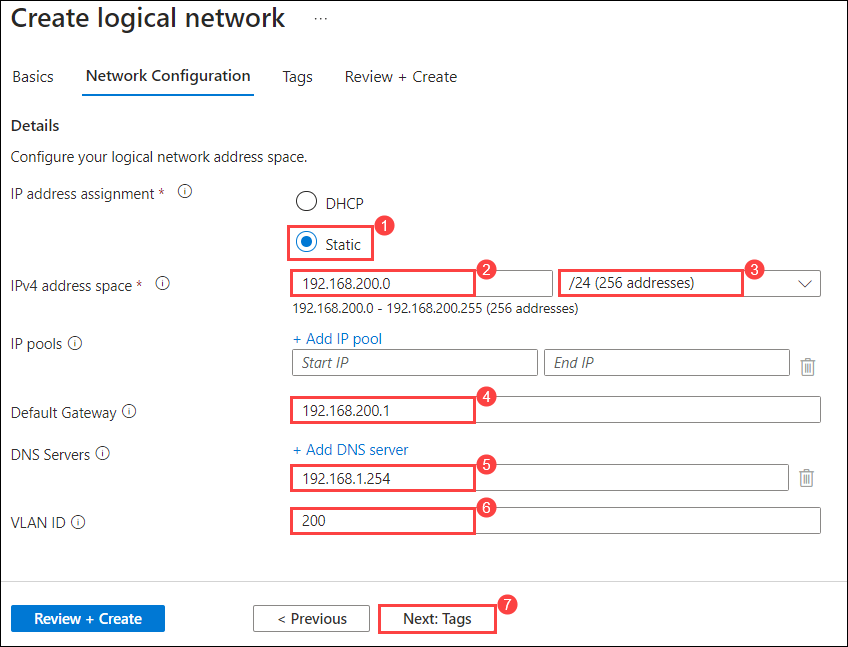

7. In the **Tag** tab, leave it as default and click **Next: Review + Create**.

8. In the **Review + Create** tab, click on on **Create** button.

   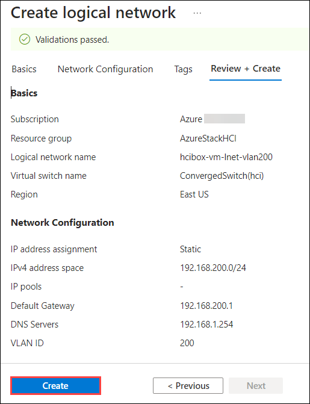

9. In the **hciboxcluster** Azure Stack HCI, from the left menu select **VM Image** **(1)** under **Resources**, click on **+ Add VM Image** **(2)**, and click on **From Azure Marketplace** **(3)**.

   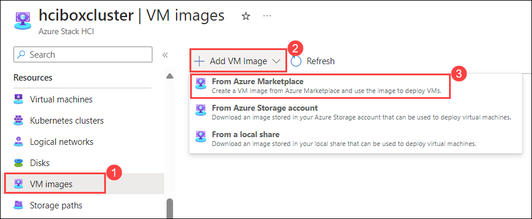

10. In the **Create an image** tab, enter the fallowing details and click on **Review + Create** **(6)** button.

    - Resource group : **AzureStackHCI** **(1)**
    - Save image as: Enter Image name as **hci-vm** **(2)**
    - Custom location: From the drop-down select **jumpstart** **(3)**
    - Image to download: Select **select Windows 10 Enterprise multi-session, version 21H2 - Gen2** **(4)** VM image.
    - Storage path: select **Choose automatically** **(5)**

      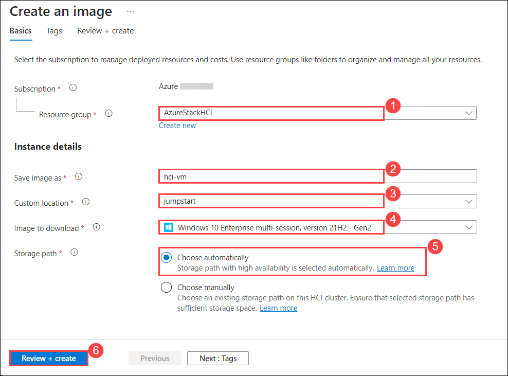

11. In the **Review + Create** tab, click on **Create** button.

    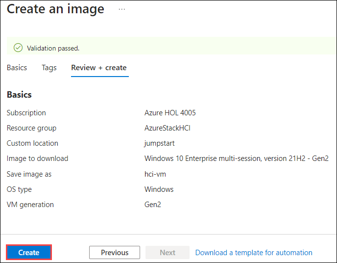

    > **Note**: VM images download may take upto 1 hour.

### Task 4: Monitor Cluster in Windows Admin Center

23. Once the deployment got succedded, navigate back to **hciboxcluster** Azure Stack HCI, from the left menu select **Windows Admin Center (preview)** **(1)** under setting and click on **SetUp** **(2)**.

    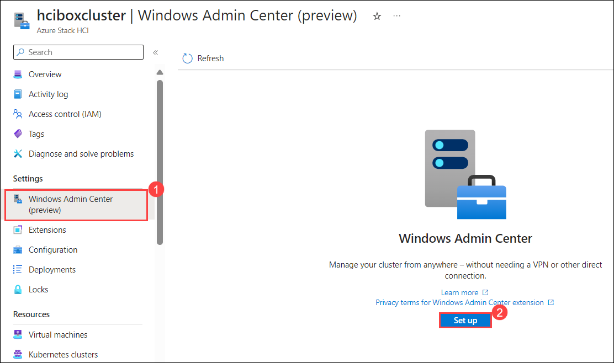

24. In the **Windows Admin Center** pop-up leave Listening port to **6516**, click on **Install**. 

    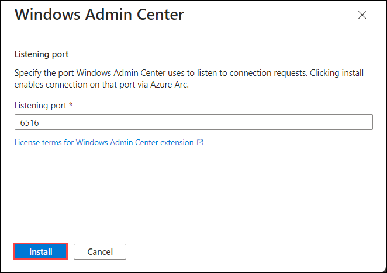

   > **Note**: This may take 5 minutes to get ready please wait


1. 
