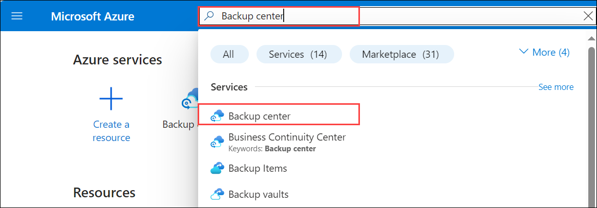
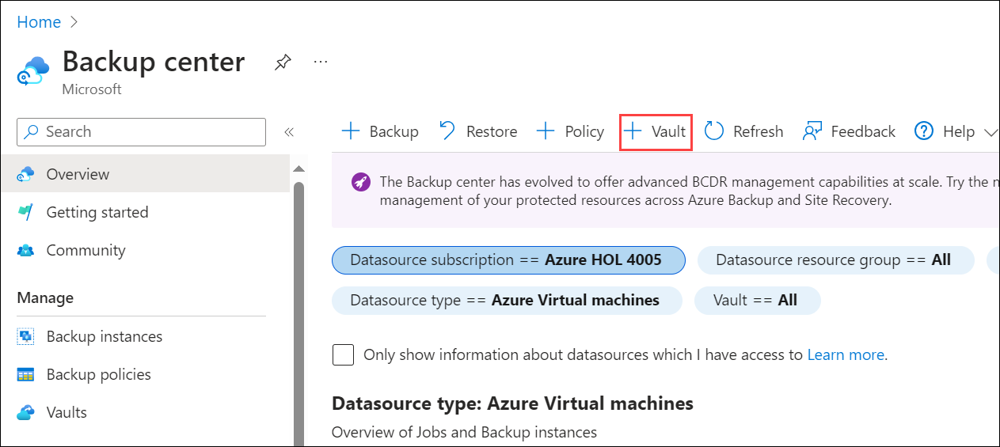
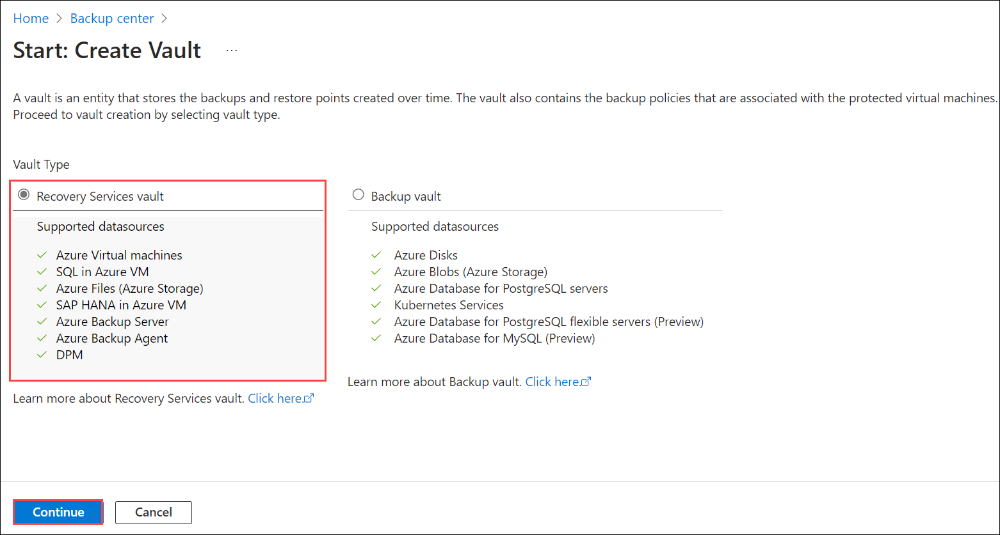
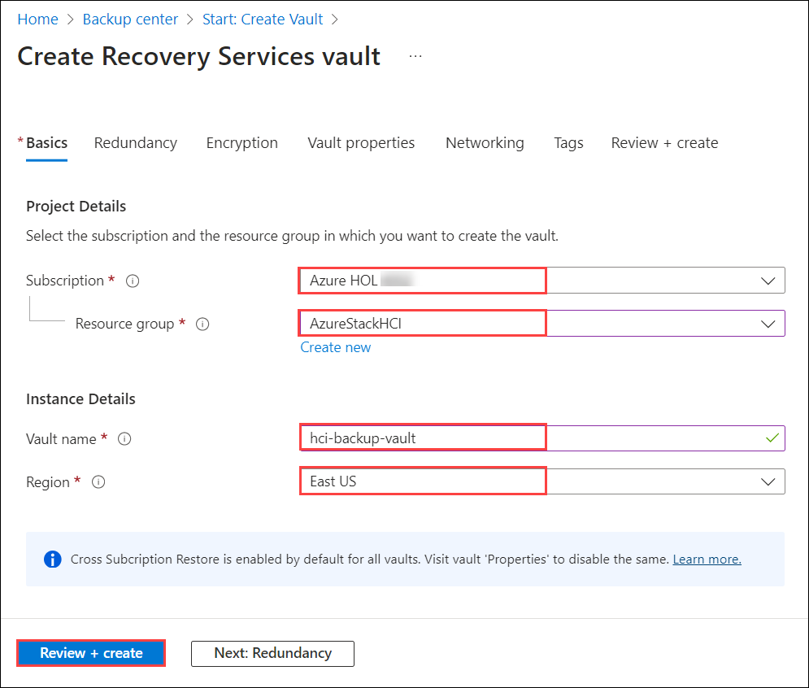
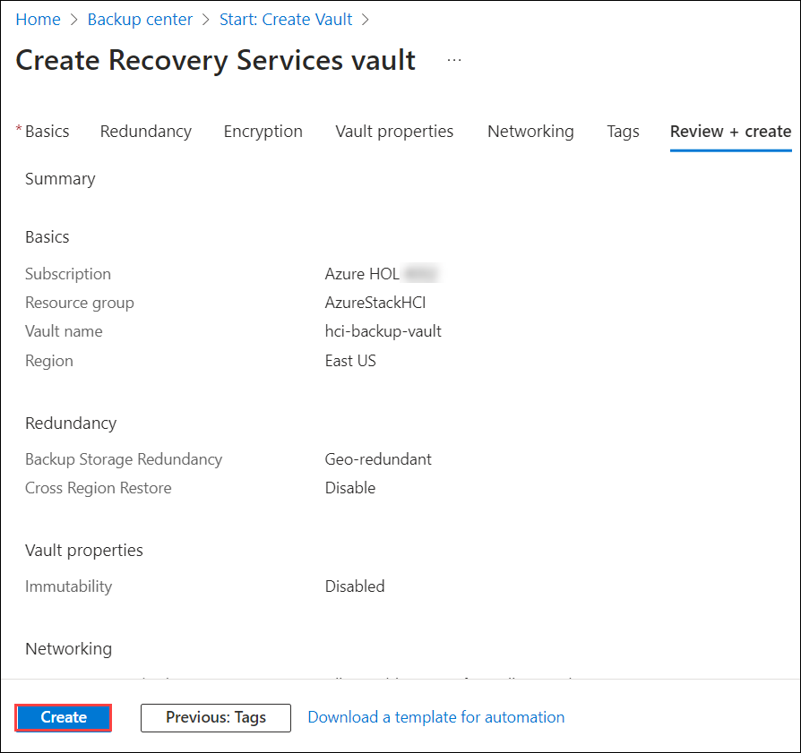
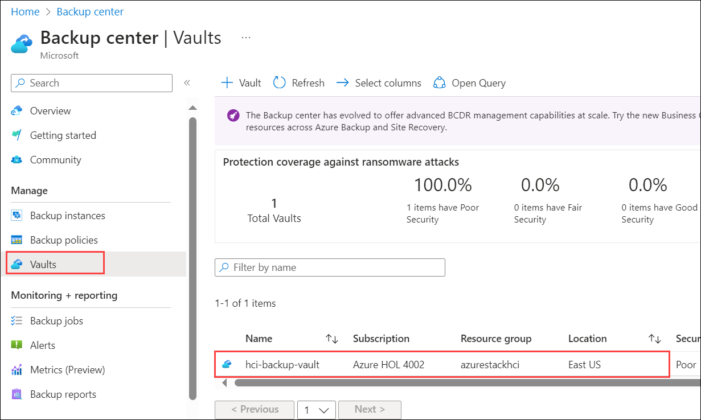

# Exercise 2: Azure Backup Server on Azure Stack

In this exercise, you will learn how to install Azure Backup Server on Azure Stack, which enables backup and recovery capabilities for files and applications within the Azure environment. This exercise focuses on deploying and configuring Azure Backup Server to safeguard critical data and applications hosted on Azure Stack, ensuring robust protection and restore capabilities in the cloud environment.

### Task 1: Create a Recovery Service Vault

A Recovery Services vault is a management entity that stores recovery points that are created over time, and it provides an interface to perform backup-related operations. These operations include taking on-demand backups, performing restores, and creating backup policies.

1. In the Azure portal, search for **Backup center** and then navigate to the **Backup center** dashboard.

   

2. On the Overview pane, select Vault.

   

3. Select Recovery Services vault > Continue.

   

4. On the Recovery Services vault pane, enter the following values:

    - Subscription: Select the available subscription to use
    - Resource group: Use an existing resource group named **AzureStackHCI**
    - Vault name: **hci-backup-vault** 
    - Region: select the same region where Azure Satck HCI is deployed i.e, **East US**

   

5. After providing the values, select Review + create.

   

6. To finish creating the Recovery Services vault, select Create.

   It can take a while to create the Recovery Services vault. Monitor the status notifications in the Notifications area at the upper right. After the vault is created, it appears in the list of Recovery Services vaults. If the vault doesn't appear, select Refresh.

   

   

