# Exercise 3: Managing AKS on Azure Stack HCI 

In this exercise, you'll be focusing on managing Azure Kubernetes Service (AKS) on Azure Stack HCI, which involves creating a logical network specifically tailored for AKS on Azure Stack HCI. It also covers setting up an Azure Active Directory (AAD) tenant group for authentication purposes. The process involves deploying AKS on Azure Stack HCI via the Azure Portal and establishing the necessary connections to access the AKS deployment. This hands-on lab demonstrates the setup and configuration steps required for deploying and managing AKS in an Azure Stack HCI environment.

### Task 1: Create a Logical Network for Azure Stack HCI for AKS

1. Navigate to the Resource Group in the Azure portal navigation section.

   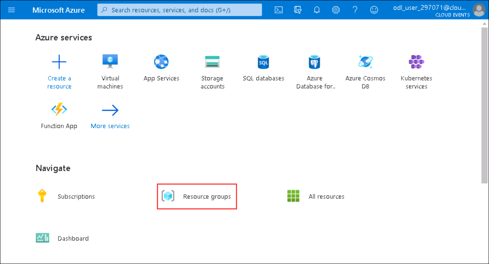

2. From the Resource groups pane, click on **AzureStakHCI** resource group and verify the resources present in it.

   

3. In the  **AzureStakHCI** resource group in the search bar search for **hciboxcluster** **(1)** and select **hciboxcluster** **(2)** Azure Stack HCI.

   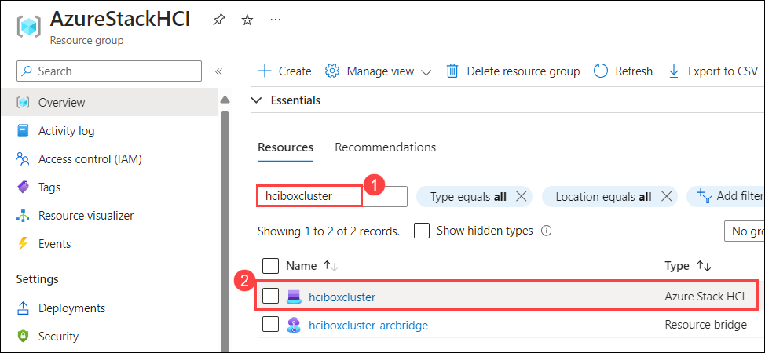

4. In the **hciboxcluster** Azure Stack HCI, from the left menu select **Logical networks** **(1)** under Resources, and click on **+ Create logical network** **(2)**.

   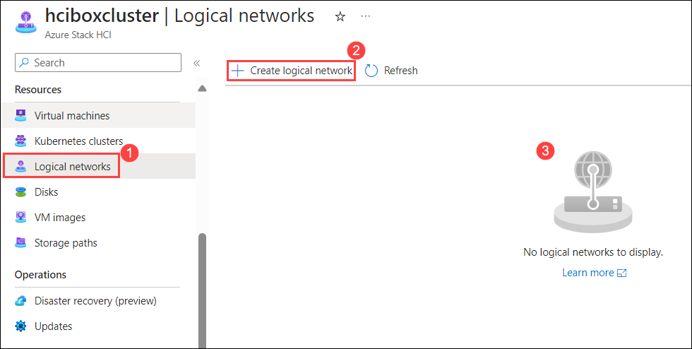

5. In the **Create logical network** tab, under Basic fill the fallowing details and click on **Next: Network Configuartion** **(5)**.

    - Subscription : Default subscription **(1)**
    - Resource group : **AzureStackHCI** **(2)**
    - Logical network name: **hcibox-aks-lnet-vlan110** **(3)**
    - Virtual switch name: **ConvergedSwitch(hci)** **(4)**

   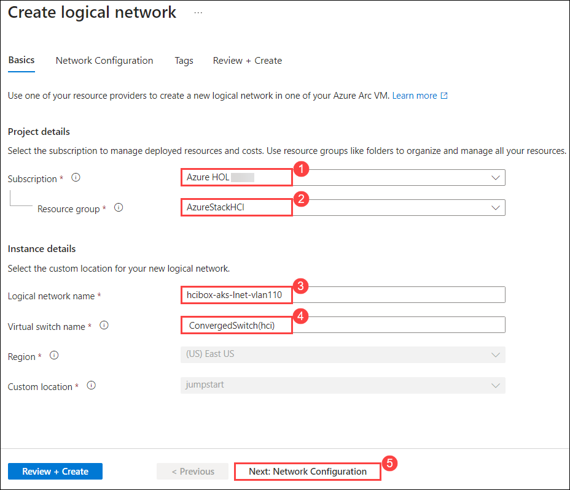

6. In the **Network Configuation** tab, under the fallowing deatils and click on **Next: Tags** **(9)**.

    | **Variables**                | **Values**                                                    |
    | ---------------------------- |---------------------------------------------------------------|
    | IP address assignment | **Static** **(1)** |
    | IPv4 address space    | **10.10.0.0** **(2)** from the drop down  address prefix select **\24** **(3)** |
    | IP pools              | Enter Start IP **10.10.0.101** **(4)** and End IP **10.10.0.199** **(5)** |
    | Default Gateway       | Enter Default Gateway address as **10.10.0.1** **(6)** |
    | DNS Servers           | Enter DNS Servers **192.168.1.254** **(7)** |
    | VLAN ID               | Enter **110** **(8)** | 

   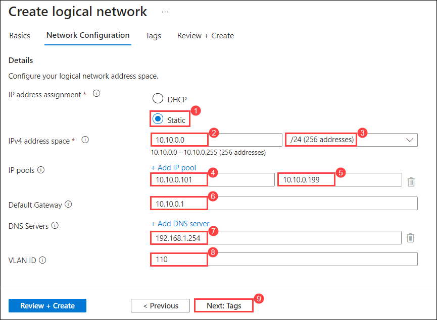

7. In the **Tag** tab, leave it as default and click **Next: Review + Create**.

8. In the **Review + Create** tab, click on on **Create** button.

   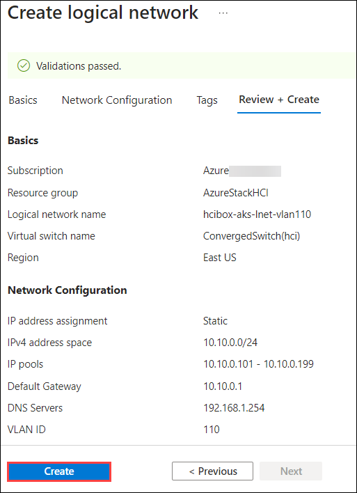

### Task 2: Create an Entra Group for authentication of AKS

1. In the Azure portal, click on the search blade at the top and search for **Microsoft Entra id** and select **Microsoft Entra id**.

   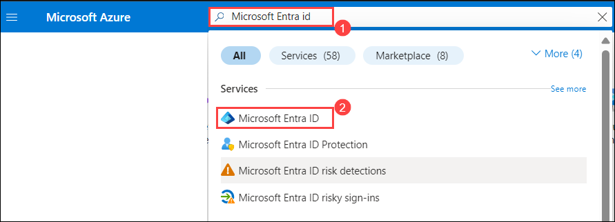

10. In the **Microsoft Entra id** tab, from the left menu select **Groups** under Manage. 

    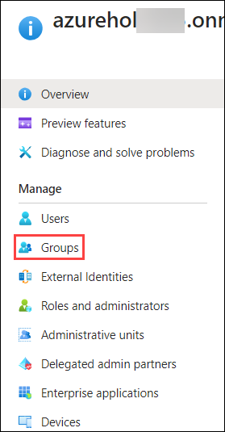

11. In the **Groups | All groups** tab, select **All groups** **(1)**,  and click on **New Group** **(2)**.

    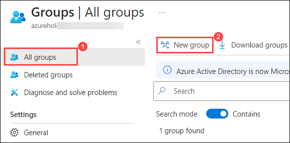

12. In the **New Group** tab, enter the **Group name** as **aks-auth** **(1)**, click on the **No Owner Selected** **(2)** under **Owners**, from the search **(3)** and select **(4)** for user **ODL_User <inject key="DeploymentID"></inject>**, and click on **Select** **(5)**.

    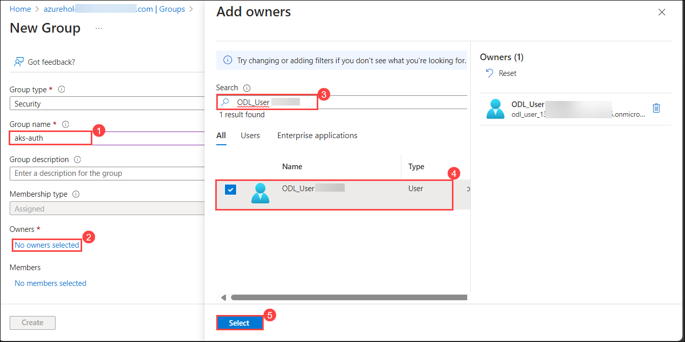

13. In the **New Group** tab, click on **Create** button.

    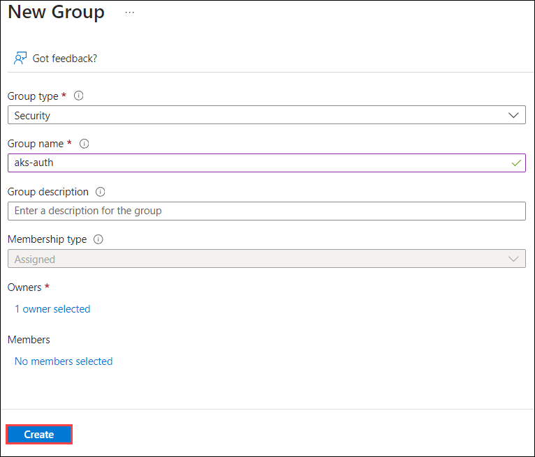


# Task 3: Create AKS on Azure Stack HCI using Azure Portal

1. In the Azure portal, click on the search blade at the top and search for **Kubernetes services** and select **Kubernetes services**.

    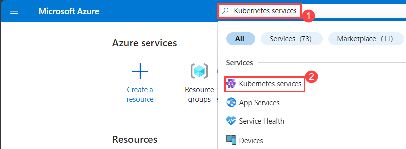

1. In the **Kubernetes services** tab, click on **+ Create** **(1)** and from the drop-down select **Create a Kubernetes cluster with Azure Arc** **(2)**.

    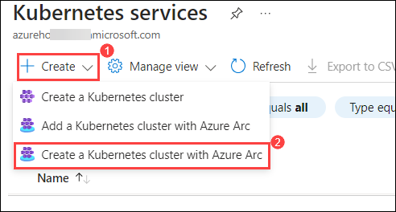

16. In the **Create a Kubernetes cluster with Azure Arc​** tab, fill the fallowing deatils in the Basic and click on **Next: Node Pool** **(7)**.

     | **Variables**                | **Values**                                                    |
     | ---------------------------- |---------------------------------------------------------------|
     | Subscription | Default subscription **(1)** |
     | Resource group | From the drop-down Select **AzureStackHCI** **(2)**  |
     | Kubernetes cluster name | Enter the cluster name as **hciaks** **(3)** |
     | Custom location | From the drop-down Select **jumpstart(EastUS)** **(4)** |
     | Node size | From the drop down select **Standard_A2_v2** **(5)** |
     | Key pair name | Enter the Key pair name as **hciaks** **(6)** |

    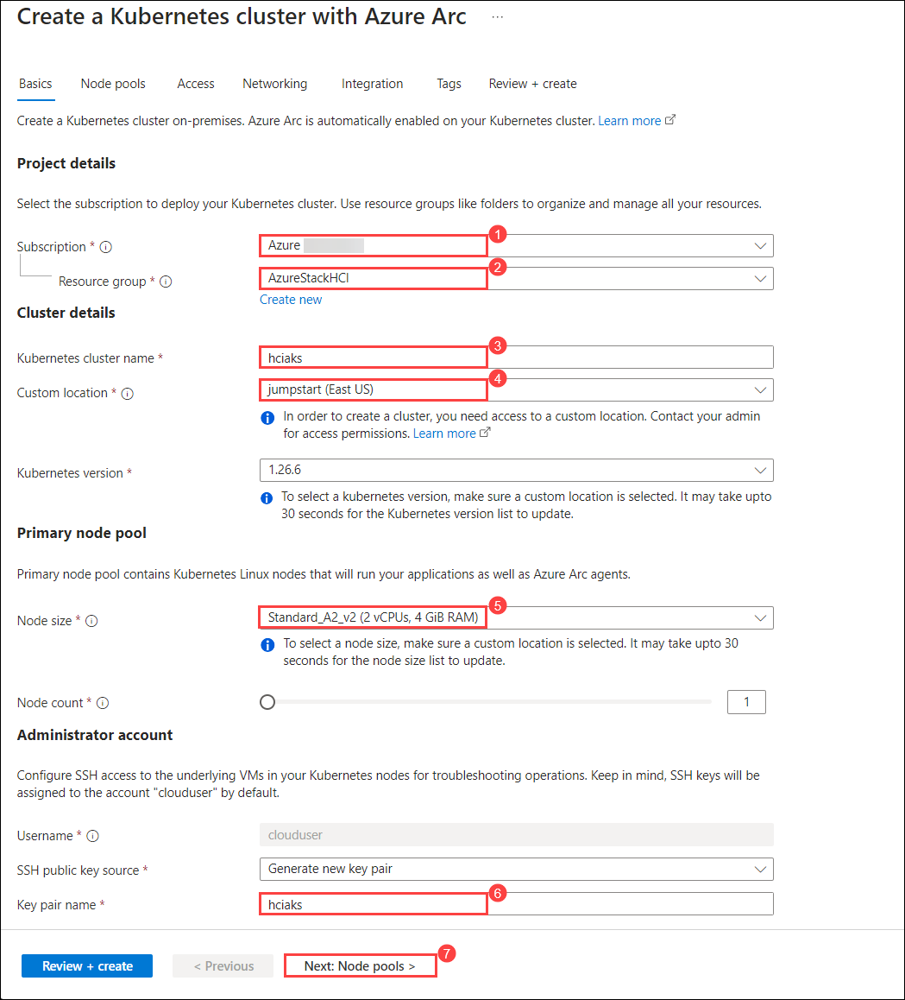

17. In the **Node Pool** tab, leave it default and click in **Next: Access**.

18. In the **Access** tab, select **Authentication and Authorization** method as **Microsoft Entra authentication with Kubernetes RBAC** **(1)**, and Click on **Choose Microsoft Entra group** **(2)**. 

    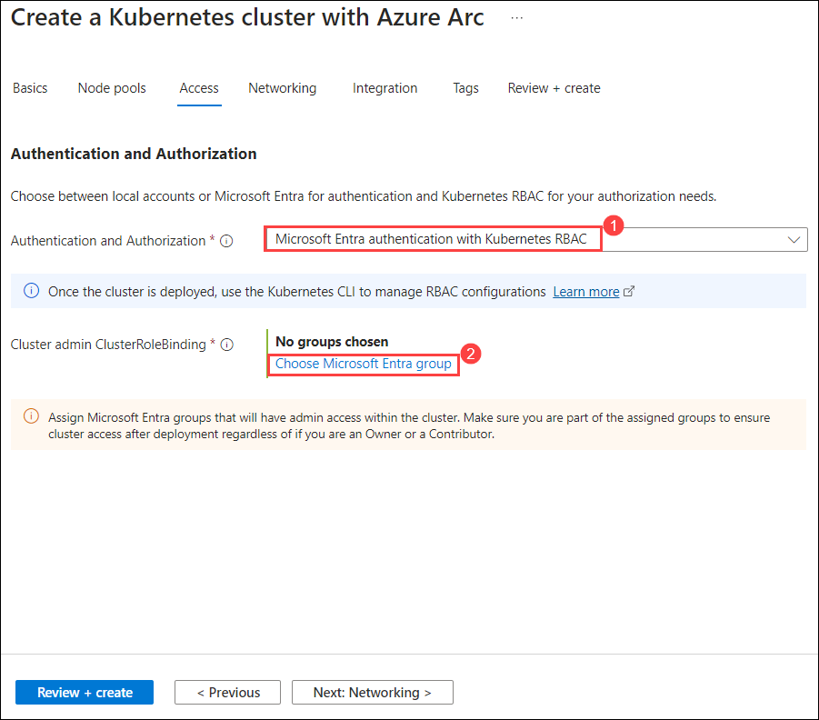

19. In the **Choose Microsoft Entra group for cluster-admin ClusterRoleBinding** pop-up select **aks-auth** group and click on **Select**.

    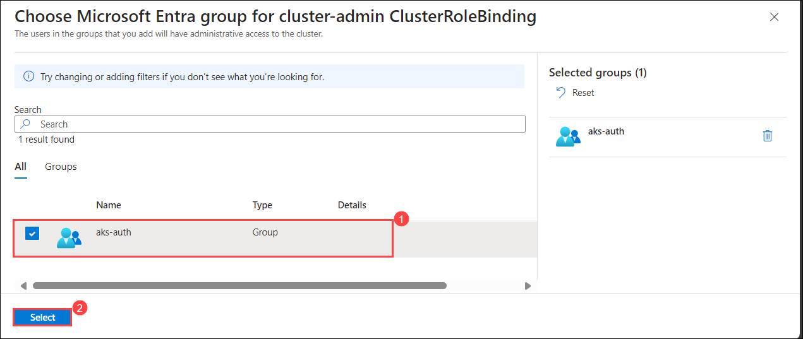

20. In the **Access** tab, click on **Next: Networking**.

21. In the **Networking** tab, select **Local network** as **hcibox-aks-lnet-vlan110** **(1)**, enter **Control plane IP** as **10.10.0.5** **(2)**, and click on **Review + Create** **(3)** .

    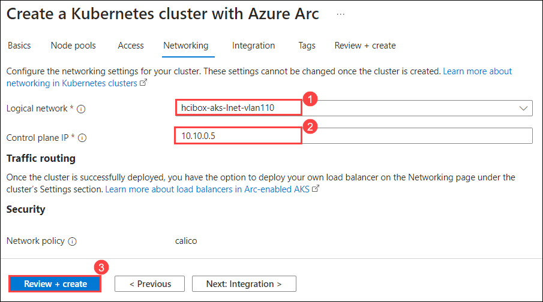

22. In the **Review + Create** tab, click on **Review**.

    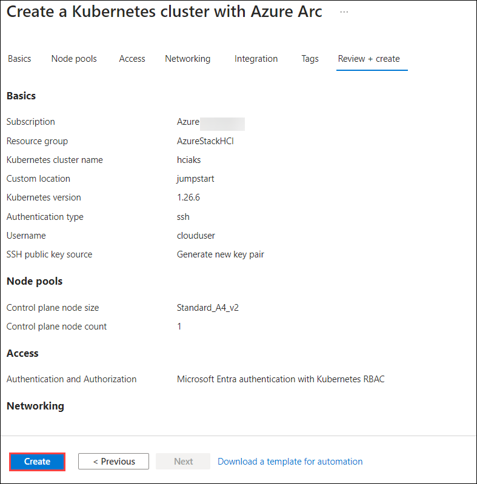

23. Click on the AKS cluster to view details such as Kubernetes version. "Status" may show connecting for some time while the cluster fully connects to Azure.

     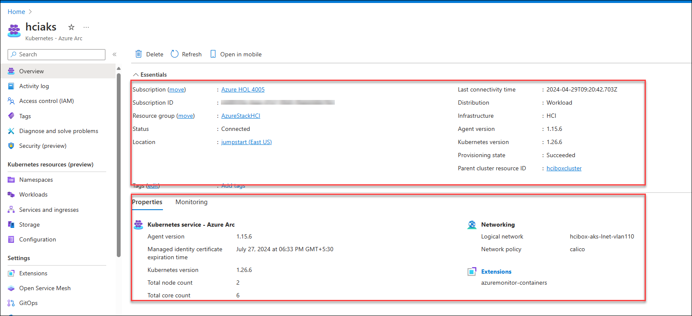
    
### Task 4: Connecting to the Azure Stack HCI AKS

1. From your jumpVM, open Powershel and run the following command, using the name of your HCIBox resource group.

   >Note: Powershell ISE will not work as it may need some inputs while executing the command. 

    ```
    az connectedk8s proxy -n hciaks -g AzureStackHCI
    ```
     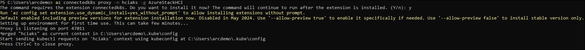
   
   >Note: If you get any option to install any extension, please enter **Y**.    

3. From JumpVM,Open a new powershell session and then in the new shell you will have kubectl access to your cluster. Try running some kubectl commands for yourself.

    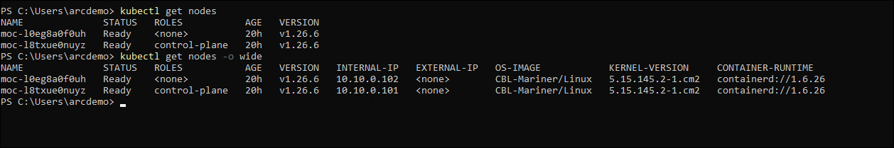
