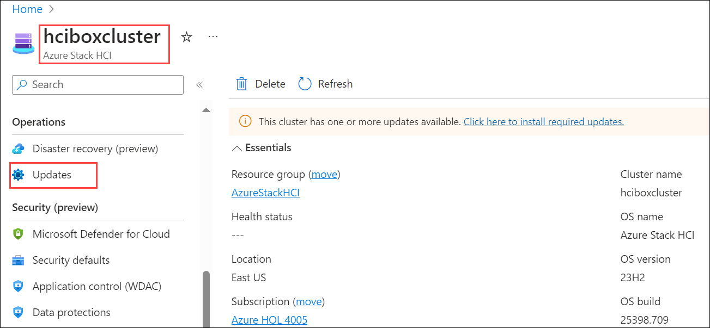
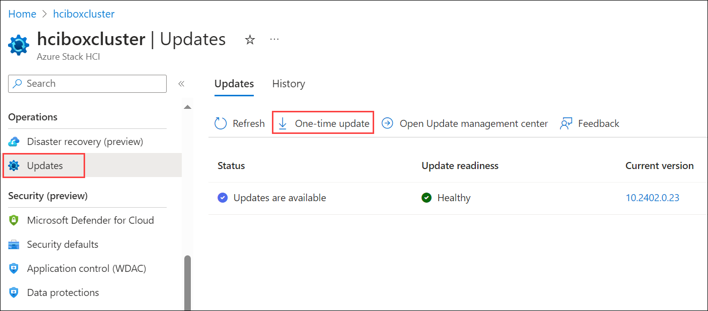
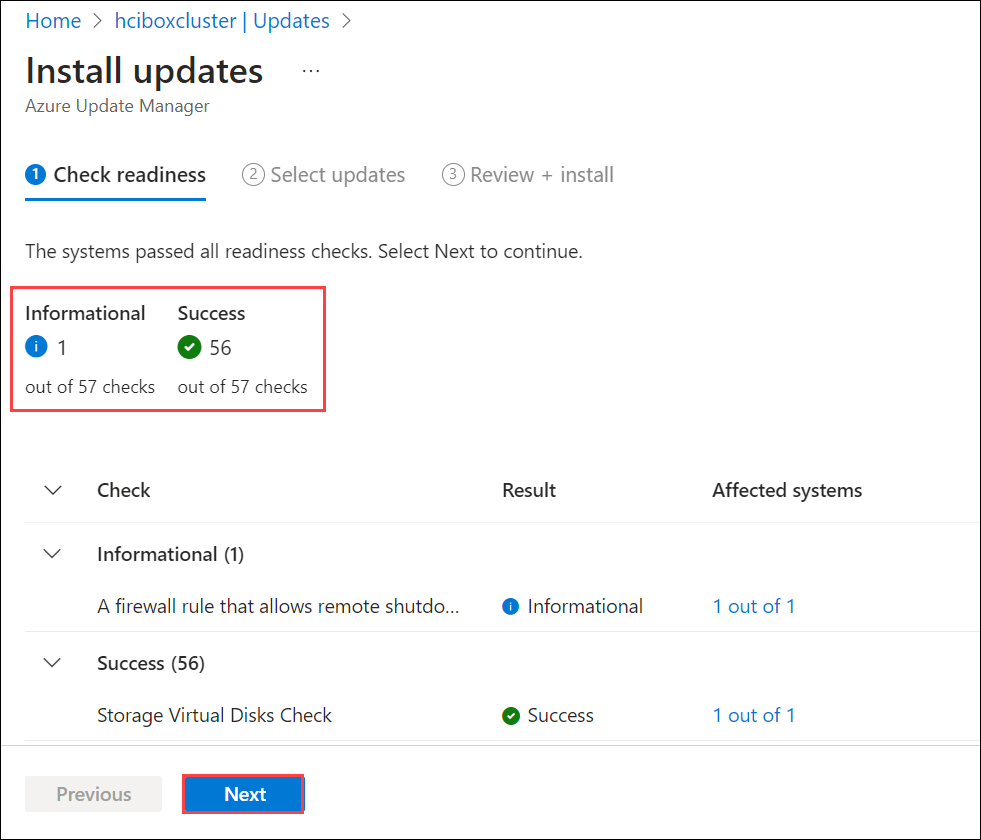
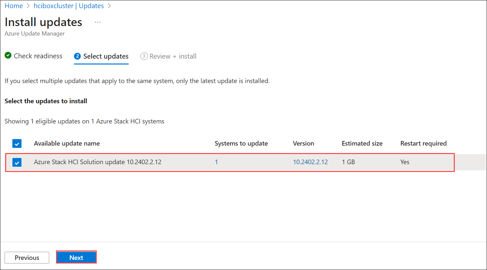
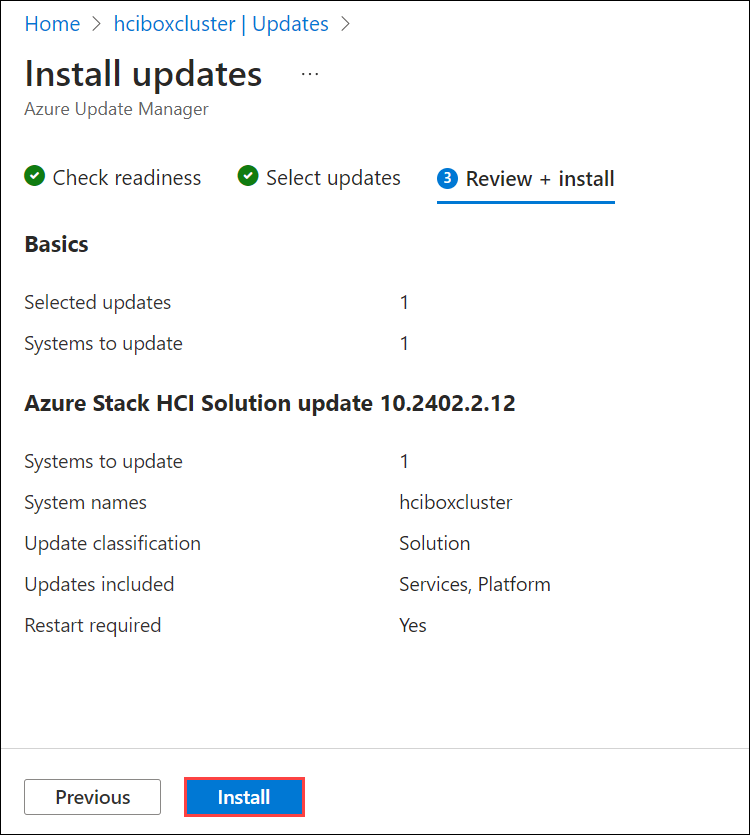
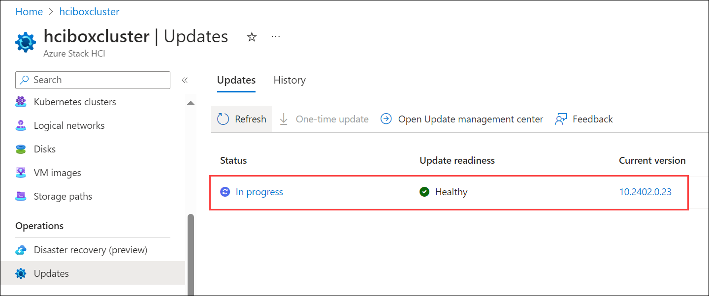

# Exercise 5: Azure Stack HCI Update management using Azure Portal  

In this exercise, you'll be checking for updates in Azure Stack HCI via the Azure Portal involves leveraging Azure Arc for centralized management and update assessment. Administrators can deploy updates seamlessly across clusters, scheduling and monitoring the process for minimal disruption and optimal infrastructure performance. This integration streamlines hybrid cloud operations, enhancing agility and security across on-premises and Azure environments.

### Task 1: Update Azure Stack HCI  

1. Navigate to Azure Stack HCI resource named **hciboxcluster** from AzureStackHCI resource group.

2. In the Azure Stack HCI page, select **Updates** under Operations from left menu.

   

3. From Updates pane, click on **One-time update**.

   

4. In the Install updates pane from Azure Update manager, verify the available updates and click on **Next**.

   
  
5. Select the available updates to install and click on **Next**.

   

6. From Review + install pane, review the selected updates and click on **Install**.

   

7. You will see a notification that **Installation started on 1 Azure Stack HCI systems**. Also, you will be able to see the In-progress status from Updates pane.

   

